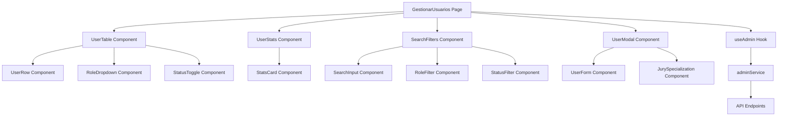
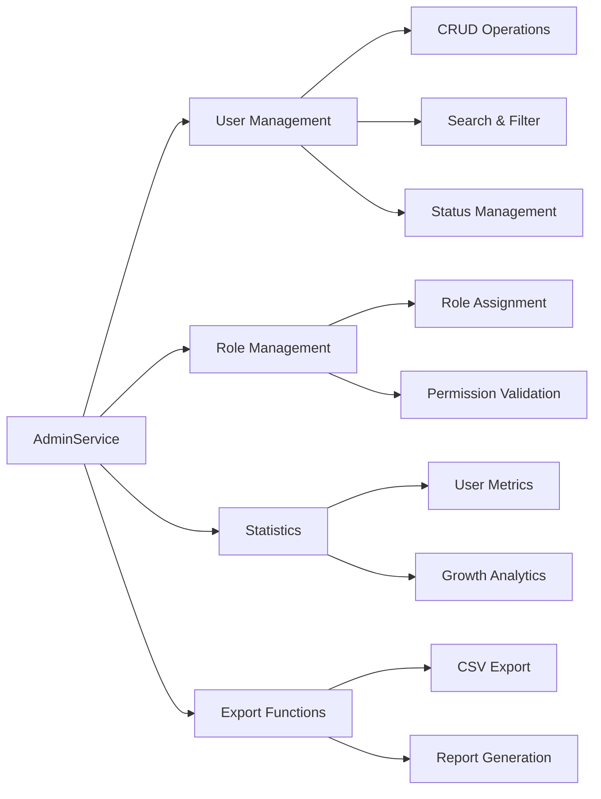

# Design Document: Admin User Management System

## Overview

El sistema de gestión de usuarios para administradores del WebFestival Platform proporciona una interfaz completa para administrar usuarios, roles, permisos y especialización de jurados. El diseño se enfoca en una experiencia de usuario eficiente con funcionalidades robustas de búsqueda, filtrado, estadísticas y operaciones en lote.

## Architecture

### Component Architecture



### Service Layer Architecture



## Components and Interfaces

### Core Components

#### 1. GestionarUsuarios (Main Page)
```typescript
interface GestionarUsuariosProps {
  // No props - standalone page
}

interface GestionarUsuariosState {
  usuarios: User[];
  stats: UserStats | null;
  loading: boolean;
  error: string | null;
  filtros: UserFilters;
  selectedUser: User | null;
  showUserModal: boolean;
}
```

#### 2. UserTable Component
```typescript
interface UserTableProps {
  usuarios: User[];
  loading: boolean;
  onRoleChange: (userId: string, role: string) => Promise<void>;
  onStatusToggle: (userId: string) => Promise<void>;
  onViewUser: (user: User) => void;
  onEditUser: (user: User) => void;
  updating: string | null;
}
```

#### 3. UserStats Component
```typescript
interface UserStatsProps {
  stats: UserStats | null;
  loading: boolean;
  onRefresh: () => void;
}

interface UserStats {
  totalUsuarios: number;
  usuariosActivos: number;
  usuariosInactivos: number;
  usuariosPorRol: Record<string, number>;
  crecimientoMensual: Array<{ mes: string; usuarios: number }>;
  registrosRecientes: User[];
}
```

#### 4. SearchFilters Component
```typescript
interface SearchFiltersProps {
  filtros: UserFilters;
  onFilterChange: (filtros: UserFilters) => void;
  stats: UserStats | null;
  loading: boolean;
}

interface UserFilters {
  search?: string;
  role?: string;
  status?: 'active' | 'inactive' | 'all';
  dateRange?: 'today' | 'week' | 'month' | 'all';
  page: number;
  limit: number;
  sortBy?: 'created_at' | 'nombre' | 'email' | 'updated_at';
  sortOrder?: 'asc' | 'desc';
}
```

#### 5. UserModal Component
```typescript
interface UserModalProps {
  user: User | null;
  isOpen: boolean;
  mode: 'view' | 'edit' | 'create';
  onClose: () => void;
  onSave: (userData: CreateUserDto | UpdateUserDto) => Promise<void>;
  onDelete?: (userId: string) => Promise<void>;
}
```

### Service Interfaces

#### AdminService Enhanced Methods
```typescript
interface AdminService {
  // User Management
  getUsers(filters: UserFilters): Promise<PaginatedResponse<User>>;
  getUserDetails(userId: string): Promise<UserDetailResponse>;
  createUser(userData: CreateUserDto): Promise<User>;
  updateUser(userId: string, userData: UpdateUserDto): Promise<User>;
  deleteUser(userId: string): Promise<void>;
  
  // Role Management
  updateUserRole(userId: string, role: string): Promise<User>;
  updateUserRoles(userId: string, roles: string[]): Promise<User>;
  validateRoleChange(userId: string, newRole: string): Promise<boolean>;
  
  // Status Management
  toggleUserStatus(userId: string): Promise<User>;
  bulkStatusUpdate(userIds: string[], status: boolean): Promise<User[]>;
  
  // Password Management
  forcePasswordChange(userId: string, newPassword: string): Promise<void>;
  sendPasswordReset(userId: string): Promise<void>;
  
  // Statistics
  getUserStats(): Promise<UserStats>;
  getUserActivity(userId: string, limit?: number): Promise<ActivityLog[]>;
  
  // Export
  exportUsers(filters?: Partial<UserFilters>): Promise<Blob>;
  generateUserReport(reportType: string, filters?: UserFilters): Promise<Blob>;
  
  // Jury Management
  getJuradosByEspecialidad(especialidad?: string): Promise<User[]>;
  updateJurySpecialization(userId: string, specialization: JurySpecialization): Promise<User>;
  asignarJurado(usuarioId: string, categoriaId: number): Promise<JuradoAsignacion>;
  
  // Social Management
  getUserFollowers(userId: string): Promise<User[]>;
  getUserFollowing(userId: string): Promise<User[]>;
  removeFollowRelationship(followerId: string, followedId: string): Promise<void>;
}
```

## Data Models

### Enhanced User Model
```typescript
interface User {
  id: string;
  email: string;
  nombre: string;
  bio?: string;
  picture_url?: string;
  roles: ('PARTICIPANTE' | 'JURADO' | 'ADMIN' | 'CONTENT_ADMIN')[];
  primaryRole?: 'PARTICIPANTE' | 'JURADO' | 'ADMIN' | 'CONTENT_ADMIN';
  activo: boolean;
  created_at: Date;
  updated_at: Date;
  last_login?: Date;
  
  // Extended fields for admin management
  email_verified: boolean;
  phone?: string;
  location?: string;
  social_links?: SocialLinks;
  preferences?: UserPreferences;
  
  // Statistics
  stats?: {
    concursosParticipados: number;
    mediosSubidos: number;
    evaluacionesRealizadas?: number;
    seguidores: number;
    siguiendo: number;
  };
  
  // Jury specific
  jurySpecialization?: JurySpecialization;
}
```

### Jury Specialization Model
```typescript
interface JurySpecialization {
  id: string;
  usuario_id: string;
  especializaciones: ('fotografia' | 'video' | 'audio' | 'corto_cine')[];
  experiencia_años: number;
  certificaciones: string[];
  portfolio_url?: string;
  bio_profesional?: string;
  disponibilidad: boolean;
  created_at: Date;
  updated_at: Date;
}
```

### Activity Log Model
```typescript
interface ActivityLog {
  id: string;
  usuario_id: string;
  action: string;
  description: string;
  metadata?: Record<string, any>;
  ip_address?: string;
  user_agent?: string;
  created_at: Date;
}
```

### Pagination Response Model
```typescript
interface PaginatedResponse<T> {
  data: T[];
  total: number;
  page: number;
  totalPages: number;
  hasNext: boolean;
  hasPrev: boolean;
}
```

## Correctness Properties

*A property is a characteristic or behavior that should hold true across all valid executions of a system-essentially, a formal statement about what the system should do. Properties serve as the bridge between human-readable specifications and machine-verifiable correctness guarantees.*

### Property Reflection

Después de analizar todos los criterios de aceptación, se identificaron las siguientes propiedades testables. Se eliminaron redundancias donde una propiedad implica otra:

- Las propiedades de filtrado (2.1, 2.3, 2.4) se pueden combinar en una propiedad comprehensiva de filtrado
- Las propiedades de manejo de errores (3.4, 7.4, 9.2) siguen un patrón similar pero para diferentes operaciones
- Las propiedades de actualización de UI (3.3, 4.4, 8.5) comparten el comportamiento de actualización inmediata

### Propiedades de Correctness

**Property 1: Paginación funcional**
*Para cualquier* conjunto de usuarios y tamaño de página válido (10, 20, 50, 100), la paginación debe mostrar el número correcto de usuarios por página y calcular correctamente el número total de páginas
**Validates: Requirements 1.1, 1.5**

**Property 2: Búsqueda de usuarios**
*Para cualquier* término de búsqueda válido (nombre o email), el sistema debe retornar solo usuarios que contengan el término en su nombre o email, con resultados resaltados
**Validates: Requirements 1.2**

**Property 3: Información completa de usuario**
*Para cualquier* usuario mostrado en la lista, debe incluir avatar, nombre, email, rol primario, todos los roles, estado y fecha de registro
**Validates: Requirements 1.3**

**Property 4: Filtrado comprehensivo**
*Para cualquier* combinación de filtros (rol, estado, rango de fechas), el sistema debe aplicar lógica AND y mostrar solo usuarios que cumplan todos los criterios seleccionados
**Validates: Requirements 2.1, 2.3, 2.4**

**Property 5: Conteo de roles preciso**
*Para cualquier* conjunto de usuarios, los contadores en los botones de filtro de rol deben reflejar exactamente el número de usuarios con cada rol
**Validates: Requirements 2.2**

**Property 6: Persistencia de filtros en navegación**
*Para cualquier* estado de filtros aplicados, navegar entre páginas debe mantener todos los filtros activos
**Validates: Requirements 2.5, 5.5**

**Property 7: Opciones de rol completas**
*Para cualquier* dropdown de rol, debe mostrar todas las opciones disponibles: Participante, Jurado, Content Admin, Admin
**Validates: Requirements 3.1**

**Property 8: Cambio de rol inmediato**
*Para cualquier* cambio de rol válido, el sistema debe actualizar el rol primario del usuario inmediatamente y mostrar confirmación
**Validates: Requirements 3.2, 3.3**

**Property 9: Manejo de errores de rol**
*Para cualquier* fallo en cambio de rol, el sistema debe mostrar mensaje de error específico y revertir el estado de la UI
**Validates: Requirements 3.4, 7.4, 9.2**

**Property 10: Toggle de estado funcional**
*Para cualquier* usuario, el toggle de estado debe cambiar entre activo e inactivo y actualizar la UI inmediatamente con confirmación
**Validates: Requirements 4.1, 4.4**

**Property 11: Información detallada de perfil**
*Para cualquier* usuario, el visor de perfil debe mostrar información detallada incluyendo estadísticas (concursos participados, medios subidos, evaluaciones realizadas)
**Validates: Requirements 5.1, 5.2**

**Property 12: Información específica de jurado**
*Para cualquier* usuario con rol de jurado, el perfil debe mostrar especializaciones y categorías asignadas
**Validates: Requirements 5.3, 6.1**

**Property 13: Historial de actividad**
*Para cualquier* perfil de usuario, debe mostrar acciones recientes e historial de login
**Validates: Requirements 5.4**

**Property 14: Gestión de especializaciones de jurado**
*Para cualquier* actualización de especializaciones de jurado, los cambios deben guardarse y actualizar las asignaciones de categorías apropiadamente
**Validates: Requirements 6.2, 6.5**

**Property 15: Categorías filtradas por especialización**
*Para cualquier* asignación de jurado a categorías, solo deben mostrarse categorías que coincidan con sus especializaciones
**Validates: Requirements 6.3**

**Property 16: Advertencias de especialización**
*Para cualquier* remoción de especializaciones de jurado, debe mostrar advertencia si existen asignaciones de categorías existentes
**Validates: Requirements 6.4**

**Property 17: Exportación con filtros**
*Para cualquier* conjunto de filtros aplicados, la exportación debe generar un CSV que incluya solo los usuarios filtrados con todos los campos requeridos (ID, nombre, email, roles, estado, fecha de registro)
**Validates: Requirements 7.1, 7.2, 7.5**

**Property 18: Estadísticas completas y precisas**
*Para cualquier* carga de la página de gestión, las estadísticas deben mostrar conteo total de usuarios, usuarios activos, usuarios por rol, tendencias de crecimiento mensual y registros recientes
**Validates: Requirements 8.1, 8.2**

**Property 19: Actualización automática de estadísticas**
*Para cualquier* cambio de rol o estado de usuario, las estadísticas deben actualizarse automáticamente para reflejar los nuevos valores
**Validates: Requirements 8.5**

**Property 20: Indicadores de estado de carga**
*Para cualquier* operación de carga de datos, el sistema debe mostrar indicadores de carga con texto descriptivo
**Validates: Requirements 9.1**

**Property 21: Estados de operación en progreso**
*Para cualquier* operación en progreso, los botones relevantes deben deshabilitarse y mostrar indicadores de progreso
**Validates: Requirements 9.4**

**Property 22: Verificación de autorización**
*Para cualquier* acceso al sistema de gestión de usuarios, debe verificar autorización de rol admin antes de mostrar datos
**Validates: Requirements 10.1**

**Property 23: Manejo de sesión expirada**
*Para cualquier* sesión de admin expirada, el sistema debe redirigir a la página de login y limpiar datos sensibles
**Validates: Requirements 10.2**

**Property 24: Confirmaciones para operaciones sensibles**
*Para cualquier* operación sensible (eliminar usuario, cambiar roles críticos), el sistema debe requerir diálogos de confirmación adicionales
**Validates: Requirements 10.3**

### Property Reflection

Después de analizar todos los criterios de aceptación, he identificado las siguientes propiedades testables. Algunas propiedades redundantes han sido consolidadas para evitar duplicación:

- Las propiedades de filtrado (2.1, 2.3, 2.4) se pueden combinar en una propiedad comprehensiva sobre filtrado
- Las propiedades de manejo de errores (3.4, 7.4, 9.2) siguen un patrón similar pero aplican a diferentes contextos
- Las propiedades de actualización de UI (3.3, 4.4, 8.5) comparten el comportamiento de actualización inmediata

### Propiedades de Correctness

**Property 1: Paginación funcional**
*Para cualquier* conjunto de usuarios y tamaño de página válido (10, 20, 50, 100), el sistema debe mostrar la cantidad correcta de usuarios por página y proporcionar navegación apropiada
**Validates: Requirements 1.1, 1.5**

**Property 2: Búsqueda de usuarios**
*Para cualquier* término de búsqueda válido (nombre o email), el sistema debe retornar solo usuarios que coincidan con el término y resaltar los resultados
**Validates: Requirements 1.2**

**Property 3: Información completa de usuario**
*Para cualquier* usuario mostrado en la lista, el sistema debe incluir avatar, nombre, email, rol primario, todos los roles, estado y fecha de registro
**Validates: Requirements 1.3**

**Property 4: Filtrado comprehensivo**
*Para cualquier* combinación de filtros (rol, estado, fecha), el sistema debe aplicar lógica AND y mostrar solo usuarios que cumplan todos los criterios seleccionados
**Validates: Requirements 2.1, 2.3, 2.4**

**Property 5: Conteos de filtros precisos**
*Para cualquier* conjunto de usuarios, los botones de filtro por rol deben mostrar el conteo exacto de usuarios para cada rol
**Validates: Requirements 2.2**

**Property 6: Persistencia de filtros en paginación**
*Para cualquier* estado de filtros aplicados, navegar entre páginas debe mantener los mismos filtros activos
**Validates: Requirements 2.5**

**Property 7: Opciones completas de roles**
*Para cualquier* dropdown de roles, debe mostrar todas las opciones disponibles (Participante, Jurado, Content Admin, Admin)
**Validates: Requirements 3.1**

**Property 8: Cambio de rol inmediato**
*Para cualquier* cambio de rol válido, el sistema debe actualizar el rol primario del usuario inmediatamente y mostrar confirmación
**Validates: Requirements 3.2, 3.3**

**Property 9: Manejo de errores con reversión**
*Para cualquier* operación fallida (cambio de rol, estado, etc.), el sistema debe mostrar mensaje de error específico y revertir el estado de la UI
**Validates: Requirements 3.4, 7.4, 9.2**

**Property 10: Toggle de estado funcional**
*Para cualquier* usuario, el toggle de estado debe cambiar entre activo e inactivo y actualizar la UI inmediatamente con confirmación
**Validates: Requirements 4.1, 4.4**

**Property 11: Información detallada de perfil**
*Para cualquier* usuario seleccionado, el visualizador de perfil debe mostrar información detallada incluyendo estadísticas (concursos participados, medios subidos, evaluaciones realizadas)
**Validates: Requirements 5.1, 5.2**

**Property 12: Información específica de jurado**
*Para cualquier* usuario con rol de jurado, el perfil debe mostrar especializaciones y categorías asignadas
**Validates: Requirements 5.3, 6.1**

**Property 13: Historial de actividad**
*Para cualquier* perfil de usuario, debe mostrar acciones recientes e historial de login
**Validates: Requirements 5.4**

**Property 14: Navegación sin pérdida de estado**
*Para cualquier* navegación desde perfil de usuario de vuelta a la lista, los filtros aplicados previamente deben mantenerse
**Validates: Requirements 5.5**

**Property 15: Gestión de especializaciones de jurado**
*Para cualquier* actualización de especializaciones de jurado, los cambios deben guardarse y actualizar las asignaciones de categorías apropiadamente
**Validates: Requirements 6.2**

**Property 16: Categorías filtradas por especialización**
*Para cualquier* asignación de jurado a categorías, solo deben mostrarse categorías que coincidan con sus especializaciones
**Validates: Requirements 6.3**

**Property 17: Advertencias de especialización**
*Para cualquier* remoción de especializaciones de jurado, el sistema debe advertir sobre asignaciones de categorías existentes
**Validates: Requirements 6.4**

**Property 18: Seguimiento de experiencia de jurado**
*Para cualquier* jurado, el sistema debe rastrear y mostrar años de experiencia y certificaciones
**Validates: Requirements 6.5**

**Property 19: Exportación con filtros**
*Para cualquier* conjunto de usuarios filtrados, la exportación debe generar un CSV que incluya solo los usuarios que cumplen los filtros actuales
**Validates: Requirements 7.1, 7.5**

**Property 20: Campos completos en exportación**
*Para cualquier* exportación de usuarios, el CSV debe incluir ID de usuario, nombre, email, roles, estado y fecha de registro
**Validates: Requirements 7.2**

**Property 21: Estadísticas completas y precisas**
*Para cualquier* carga de la página de gestión, las estadísticas deben mostrar conteo total de usuarios, usuarios activos, usuarios por rol, tendencias mensuales y registros recientes
**Validates: Requirements 8.1, 8.2**

**Property 22: Actualización de estadísticas**
*Para cualquier* cambio en roles o estado de usuarios, las estadísticas deben actualizarse automáticamente para reflejar los cambios
**Validates: Requirements 8.5**

**Property 23: Funcionalidad de actualización de estadísticas**
*Para cualquier* estado de estadísticas desactualizadas, debe proporcionarse un botón de actualización funcional
**Validates: Requirements 8.3**

**Property 24: Manejo de errores en estadísticas**
*Para cualquier* fallo en la carga de estadísticas, el sistema debe mostrar valores placeholder e indicadores de error
**Validates: Requirements 8.4**

**Property 25: Indicadores de carga descriptivos**
*Para cualquier* operación de carga de datos, el sistema debe mostrar indicadores de carga con texto descriptivo
**Validates: Requirements 9.1**

**Property 26: Estados de operación en progreso**
*Para cualquier* operación en progreso, el sistema debe deshabilitar botones relevantes y mostrar indicadores de progreso
**Validates: Requirements 9.4**

**Property 27: Verificación de autorización**
*Para cualquier* acceso al sistema de gestión de usuarios, debe verificarse la autorización de rol admin antes de mostrar datos
**Validates: Requirements 10.1**

**Property 28: Manejo de sesión expirada**
*Para cualquier* sesión de admin expirada, el sistema debe redirigir a la página de login y limpiar datos sensibles
**Validates: Requirements 10.2**

**Property 29: Confirmaciones para operaciones sensibles**
*Para cualquier* operación sensible (eliminación, cambios masivos), el sistema debe requerir diálogos de confirmación adicionales
**Validates: Requirements 10.3**

<function_calls>
<invoke name="prework">
<parameter name="featureName">admin-user-management