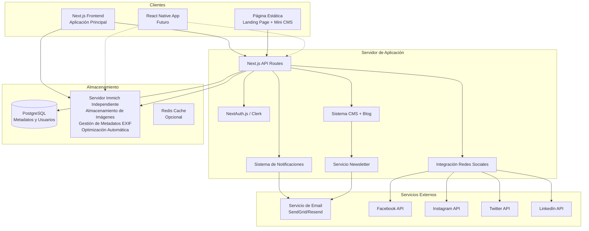

# Documento de Diseño - Plataforma WebFestival

## Visión General

WebFestival es una plataforma web completa de concursos de fotografía con arquitectura API-first, construida con Next.js 14+, TypeScript 5+ y PostgreSQL 16+. La plataforma gestiona cuatro tipos de usuarios: participantes (fotógrafos), jurados, administradores y administradores de contenido (CONTENT_ADMIN). Implementa una separación clara entre el almacenamiento de metadatos (PostgreSQL) y el almacenamiento de archivos (servidor Immich independiente), garantizando escalabilidad, rendimiento óptimo y funcionalidades sociales avanzadas con gestión inteligente de metadatos fotográficos. Incluye una página estática informativa con mini CMS integrado para gestión de contenido.

## Arquitectura

### Arquitectura General del Sistema



### Patrón de Arquitectura

- **API-First**: La API es agnóstica al cliente, permitiendo servir tanto web como móvil
- **Separación de Responsabilidades**: Frontend, API, Base de Datos y Almacenamiento de archivos están claramente separados
- **Microservicios Ligeros**: Servicios especializados para notificaciones y redes sociales
- **Almacenamiento Híbrido**: PostgreSQL para metadatos, Immich para archivos multimedia con gestión inteligente de metadatos EXIF
## Componentes y Interfaces

### 1. Sistema de Autenticación y Autorización

**Tecnología**: NextAuth.js o Clerk
**Responsabilidades**:
- Gestión de sesiones JWT
- Roles de usuario (PARTICIPANTE, JURADO, ADMIN)
- Middleware de autorización para rutas protegidas

```typescript
interface User {
  id: string;
  email: string;
  nombre: string;
  role: 'PARTICIPANTE' | 'JURADO' | 'ADMIN' | 'CONTENT_ADMIN';
  picture_url?: string;
  bio?: string;
  createdAt: Date;
  updatedAt: Date;
}

interface AuthContext {
  user: User | null;
  login: (credentials: LoginCredentials) => Promise<void>;
  logout: () => void;
  hasRole: (role: string) => boolean;
}
```

### 2. Gestión de Concursos

**Responsabilidades**:
- CRUD de concursos y categorías
- Gestión de estados del concurso
- Inscripciones de participantes

```typescript
interface Concurso {
  id: number;
  titulo: string;
  descripcion: string;
  reglas: string;
  fecha_inicio: Date;
  fecha_final: Date;
  status: 'Próximamente' | 'Activo' | 'Calificación' | 'Finalizado';
  imagen_url?: string;
  categorias: Categoria[];
  configuracion: ConfiguracionConcurso;
}

interface ConfiguracionConcurso {
  max_envios_por_participante: number; // máximo 3 por defecto
  tamaño_max_archivo: number; // en MB, 10MB por defecto
  dimensiones_max: { width: number; height: number }; // 4000x4000px por defecto
  formatos_permitidos: string[]; // ['image/jpeg', 'image/png', 'image/webp']
}
```

### 3. Sistema de Almacenamiento de Imágenes

**Tecnología**: Immich Server ([https://immich.app/](https://immich.app/))
**Responsabilidades**:
- Subida directa de archivos con extracción automática de metadatos EXIF
- Generación de URLs públicas seguras
- Optimización automática de imágenes con múltiples resoluciones
- Gestión inteligente de versiones (thumbnail, preview, original)
- Análisis automático de contenido y metadatos fotográficos

```typescript
interface ImageService {
  generateUploadUrl(userId: string, concursoId: number): Promise<UploadUrl>;
  processImage(imageUrl: string): Promise<ProcessedImage>;
  deleteImage(imageUrl: string): Promise<void>;
}

interface ProcessedImage {
  original: string;
  preview: string; // 1280x720px (16:9 widescreen)
  thumbnail: string; // 400x225px (16:9 widescreen)
  metadata: ImageMetadata;
}

interface ImageMetadata {
  exif: Record<string, any>;
  dimensions: { width: number; height: number };
  fileSize: number;
  format: string;
}
```

### 4. Sistema de Calificaciones

**Responsabilidades**:
- Asignación de jurados a categorías
- Gestión de calificaciones y comentarios
- Cálculo de puntajes finales

```typescript
interface Calificacion {
  id: number;
  foto_id: number;
  jurado_id: string;
  score_enfoque: number; // 1-10
  score_exposicion: number; // 1-10
  score_composicion: number; // 1-10
  score_creatividad: number; // 1-10
  score_impacto_visual: number; // 1-10
  comentarios?: string;
  fecha_calificacion: Date;
}

interface ResultadoFinal {
  foto_id: number;
  puntaje_promedio: number;
  posicion: number;
  categoria_id: number;
}
```

### 5. Sistema de Notificaciones

**Tecnología**: Servicio de Email (SendGrid/Resend)
**Responsabilidades**:
- Notificaciones por email
- Templates de notificación
- Cola de envío de emails

```typescript
interface NotificationService {
  sendDeadlineReminder(userId: string, concurso: Concurso): Promise<void>;
  sendEvaluationComplete(userId: string, foto: Foto): Promise<void>;
  sendResultsAnnouncement(concursoId: number): Promise<void>;
  sendNewContestNotification(concurso: Concurso): Promise<void>;
}

interface EmailTemplate {
  subject: string;
  html: string;
  text: string;
}
```

### 6. Integración con Redes Sociales

**Responsabilidades**:
- Generación de enlaces compartibles
- Integración con APIs de redes sociales
- Gestión de contenido compartido

```typescript
interface SocialShareService {
  generateShareableLink(foto: Foto, resultado: ResultadoFinal): string;
  shareToFacebook(content: ShareContent): Promise<void>;
  shareToInstagram(content: ShareContent): Promise<void>;
  shareToTwitter(content: ShareContent): Promise<void>;
  shareToLinkedIn(content: ShareContent): Promise<void>;
}

interface ShareContent {
  imageUrl: string;
  title: string;
  description: string;
  hashtags: string[];
  link: string;
}
```

### 7. Sistema de Comunidad

**Responsabilidades**:
- Seguimiento entre usuarios
- Feed de actividades
- Comentarios públicos
- Sistema de reportes

```typescript
interface CommunityService {
  followUser(followerId: string, followedId: string): Promise<void>;
  unfollowUser(followerId: string, followedId: string): Promise<void>;
  getFeed(userId: string, page: number): Promise<FeedItem[]>;
  addComment(fotoId: number, userId: string, content: string): Promise<Comment>;
  reportComment(commentId: number, reason: string): Promise<void>;
}

interface FeedItem {
  type: 'new_photo' | 'contest_win' | 'new_follow';
  user: User;
  content: any;
  timestamp: Date;
}
```

### 8. Sistema de Métricas y Analytics

**Responsabilidades**:
- Recopilación de métricas de uso
- Generación de reportes
- Dashboard de administración

```typescript
interface AnalyticsService {
  getUserMetrics(): Promise<UserMetrics>;
  getContestMetrics(concursoId?: number): Promise<ContestMetrics>;
  getJuryPerformance(): Promise<JuryMetrics>;
  getGrowthTrends(period: 'monthly' | 'yearly'): Promise<GrowthData>;
}

interface UserMetrics {
  totalUsers: number;
  activeUsers: number;
  newUsersThisMonth: number;
  usersByRole: Record<string, number>;
}

### 9. Sistema CMS Dinámico y Unificado

**Responsabilidades**:
- Sistema CMS dinámico que maneja múltiples tipos de contenido de forma unificada
- Gestión de contenido estático, blog posts y futuras extensiones
- Editor WYSIWYG integrado con campos personalizables según tipo de contenido
- Gestión de imágenes con integración directa a Immich
- Preview en tiempo real y optimización SEO automática
- Sistema unificado de comentarios y moderación
- Categorización y etiquetado flexible
- Newsletter automático para suscriptores
- Escalabilidad para nuevos tipos de contenido sin cambios de esquema

```typescript
interface CMSService {
  // Gestión de contenido principal
  getContent(filters: ContentFilters): Promise<PaginatedContent>;
  getContentBySlug(slug: string): Promise<Contenido>;
  createContent(content: CreateContentDto, userId: string): Promise<Contenido>;
  updateContent(id: number, content: UpdateContentDto, userId: string): Promise<Contenido>;
  deleteContent(id: number, userId: string): Promise<void>;
  publishContent(id: number, userId: string): Promise<void>;
  
  // Gestión de configuración
  updateContentConfig(contentId: number, config: ContenidoConfiguracion): Promise<void>;
  
  // Gestión de SEO
  updateContentSEO(contentId: number, seo: ContenidoSEO): Promise<void>;
  
  // Gestión de taxonomía
  updateContentTaxonomy(contentId: number, taxonomia: ContenidoTaxonomia[]): Promise<void>;
  getCategories(tipo?: string): Promise<string[]>;
  getTags(query?: string): Promise<string[]>;
  
  // Métricas
  updateContentMetrics(contentId: number, metricas: Partial<ContenidoMetricas>): Promise<void>;
  getContentMetrics(contentId: number): Promise<ContenidoMetricas>;
  
  // Gestión de plantillas y tipos
  getContentTypes(): Promise<ContentType[]>;
  getContentTemplate(tipo: string): Promise<ContentTemplate>;
  
  // Gestión de imágenes
  uploadImage(file: File): Promise<string>;
  previewContent(id: number): Promise<string>;
  
  // Validaciones
  validateContentAdmin(userId: string): Promise<boolean>;
}

interface Contenido {
  id: number;
  tipo: 'pagina_estatica' | 'blog_post' | 'seccion_cms';
  slug: string;
  titulo: string;
  contenido?: string;
  resumen?: string;
  imagen_destacada?: string;
  autor_id: string;
  autor: User;
  estado: 'borrador' | 'publicado' | 'archivado' | 'programado';
  fecha_publicacion?: Date;
  created_at: Date;
  updated_at: Date;
  updated_by?: string;
  
  // Relaciones (cargadas según necesidad)
  configuracion?: ContenidoConfiguracion;
  seo?: ContenidoSEO;
  metricas?: ContenidoMetricas;
  taxonomia?: ContenidoTaxonomia[];
}

interface ContenidoConfiguracion {
  contenido_id: number;
  activo: boolean;
  orden: number;
  permite_comentarios: boolean;
  destacado: boolean;
  configuracion_adicional?: Record<string, any>;
}

interface ContenidoSEO {
  contenido_id: number;
  seo_titulo?: string;
  seo_descripcion?: string;
  seo_keywords: string[];
  meta_tags?: Record<string, any>;
  structured_data?: Record<string, any>;
}

interface ContenidoMetricas {
  contenido_id: number;
  vistas: number;
  likes: number;
  comentarios_count: number;
  shares: number;
  ultima_vista?: Date;
  primera_publicacion?: Date;
}

interface ContenidoTaxonomia {
  id: number;
  contenido_id: number;
  categoria?: string;
  etiqueta?: string;
  tipo_taxonomia: 'categoria' | 'etiqueta';
}

interface ContentFilters {
  tipo?: string;
  categoria?: string;
  etiqueta?: string;
  autor?: string;
  estado?: 'borrador' | 'publicado' | 'archivado' | 'programado';
  busqueda?: string;
  activo?: boolean;
  page: number;
  limit: number;
}

interface PaginatedContent {
  contenido: Contenido[];
  total: number;
  page: number;
  totalPages: number;
}

interface ContentType {
  tipo: string;
  nombre: string;
  descripcion: string;
  campos_requeridos: string[];
  campos_opcionales: string[];
  permite_comentarios: boolean;
  tiene_orden: boolean;
  plantilla_defecto: string;
}

interface ContentTemplate {
  tipo: string;
  campos: ContentField[];
  configuracion: Record<string, any>;
}

interface ContentField {
  nombre: string;
  tipo: 'text' | 'textarea' | 'wysiwyg' | 'image' | 'select' | 'multiselect' | 'date' | 'boolean';
  requerido: boolean;
  opciones?: string[];
  validacion?: Record<string, any>;
}

interface ContentInteractionService {
  // Interacciones unificadas
  likeContent(contentId: number, tipoContenido: string, userId: string): Promise<void>;
  unlikeContent(contentId: number, tipoContenido: string, userId: string): Promise<void>;
  addComment(contentId: number, tipoContenido: string, userId: string, contenido: string, parentId?: number): Promise<ContenidoComentario>;
  moderateComment(commentId: number, approved: boolean, userId: string): Promise<void>;
  reportContent(elementId: number, tipoElemento: string, userId: string, razon: string, descripcion?: string): Promise<void>;
  
  // Estadísticas
  getContentStats(tipo?: string): Promise<ContentStats>;
  getPopularContent(tipo: string, limit: number): Promise<Contenido[]>;
  getTrendingTopics(tipo: string): Promise<string[]>;
  
  // Newsletter
  subscribeToNewsletter(email: string): Promise<void>;
  sendNewsletterDigest(): Promise<void>;
}

interface ContenidoComentario {
  id: number;
  contenido_id: number;
  tipo_contenido: string;
  usuario_id: string;
  usuario: User;
  contenido: string;
  aprobado: boolean;
  reportado: boolean;
  parent_id?: number;
  fecha_comentario: Date;
}

interface ContentStats {
  total_contenido: number;
  contenido_publicado: number;
  total_comentarios: number;
  total_vistas: number;
  total_likes: number;
  contenido_mas_popular: Contenido[];
  categorias_activas: { categoria: string; count: number }[];
  etiquetas_populares: { etiqueta: string; count: number }[];
}

interface CMSEditor {
  type: 'wysiwyg' | 'markdown' | 'html';
  content: string;
  toolbar: string[];
  plugins: string[];
  dragAndDrop: boolean;
  autoSave: boolean;
  spellCheck: boolean;
}

interface StaticPageService {
  generateSEOMetadata(content: ContenidoEstatico[]): Promise<SEOMetadata>;
  getFeaturedContests(): Promise<Concurso[]>;
  getPublicGallery(): Promise<Foto[]>;
  getFeaturedBlogPosts(limit: number): Promise<BlogPost[]>;
}

interface SEOMetadata {
  title: string;
  description: string;
  keywords: string[];
  structuredData: Record<string, any>;
}
```
```

## Modelos de Datos

### Esquema de Base de Datos Actualizado

```sql
-- Usuarios
CREATE TABLE "usuarios" (
  "id" TEXT NOT NULL PRIMARY KEY,
  "nombre" TEXT,
  "email" TEXT NOT NULL UNIQUE,
  "password" TEXT,
  "role" TEXT NOT NULL DEFAULT 'PARTICIPANTE',
  "picture_url" TEXT,
  "bio" TEXT,
  "created_at" TIMESTAMP(3) NOT NULL DEFAULT CURRENT_TIMESTAMP,
  "updated_at" TIMESTAMP(3) NOT NULL DEFAULT CURRENT_TIMESTAMP
);

-- Concursos
CREATE TABLE "concursos" (
  "id" SERIAL NOT NULL PRIMARY KEY,
  "titulo" TEXT NOT NULL,
  "descripcion" TEXT NOT NULL,
  "reglas" TEXT,
  "fecha_inicio" TIMESTAMP(3) NOT NULL,
  "fecha_final" TIMESTAMP(3) NOT NULL,
  "status" TEXT NOT NULL DEFAULT 'Próximamente',
  "imagen_url" TEXT,
  "max_envios" INTEGER DEFAULT 3,
  "tamaño_max_mb" INTEGER DEFAULT 10,
  "created_at" TIMESTAMP(3) NOT NULL DEFAULT CURRENT_TIMESTAMP
);

-- Categorías
CREATE TABLE "categorias" (
  "id" SERIAL NOT NULL PRIMARY KEY,
  "nombre" TEXT NOT NULL,
  "concurso_id" INTEGER NOT NULL,
  FOREIGN KEY ("concurso_id") REFERENCES "concursos"("id") ON DELETE CASCADE
);

-- Inscripciones
CREATE TABLE "inscripciones" (
  "id" SERIAL NOT NULL PRIMARY KEY,
  "usuario_id" TEXT NOT NULL,
  "concurso_id" INTEGER NOT NULL,
  "fecha_inscripcion" TIMESTAMP(3) NOT NULL DEFAULT CURRENT_TIMESTAMP,
  FOREIGN KEY ("usuario_id") REFERENCES "usuarios"("id") ON DELETE CASCADE,
  FOREIGN KEY ("concurso_id") REFERENCES "concursos"("id") ON DELETE CASCADE,
  UNIQUE("usuario_id", "concurso_id")
);

-- Fotografías
CREATE TABLE "fotos" (
  "id" SERIAL NOT NULL PRIMARY KEY,
  "titulo" TEXT NOT NULL,
  "usuario_id" TEXT NOT NULL,
  "concurso_id" INTEGER NOT NULL,
  "categoria_id" INTEGER NOT NULL,
  "foto_url" TEXT NOT NULL,
  "thumbnail_url" TEXT,
  "preview_url" TEXT,
  "fecha_subida" TIMESTAMP(3) NOT NULL DEFAULT CURRENT_TIMESTAMP,
  FOREIGN KEY ("usuario_id") REFERENCES "usuarios"("id") ON DELETE CASCADE,
  FOREIGN KEY ("concurso_id") REFERENCES "concursos"("id") ON DELETE CASCADE,
  FOREIGN KEY ("categoria_id") REFERENCES "categorias"("id") ON DELETE CASCADE
);

-- Asignaciones de Jurados
CREATE TABLE "jurado_asignaciones" (
  "id" SERIAL NOT NULL PRIMARY KEY,
  "usuario_id" TEXT NOT NULL,
  "categoria_id" INTEGER NOT NULL,
  FOREIGN KEY ("usuario_id") REFERENCES "usuarios"("id") ON DELETE CASCADE,
  FOREIGN KEY ("categoria_id") REFERENCES "categorias"("id") ON DELETE CASCADE,
  UNIQUE("usuario_id", "categoria_id")
);

-- Calificaciones
CREATE TABLE "calificaciones" (
  "id" SERIAL NOT NULL PRIMARY KEY,
  "foto_id" INTEGER NOT NULL,
  "jurado_id" TEXT NOT NULL,
  "score_enfoque" INTEGER NOT NULL CHECK ("score_enfoque" >= 1 AND "score_enfoque" <= 10),
  "score_exposicion" INTEGER NOT NULL CHECK ("score_exposicion" >= 1 AND "score_exposicion" <= 10),
  "score_composicion" INTEGER NOT NULL CHECK ("score_composicion" >= 1 AND "score_composicion" <= 10),
  "score_creatividad" INTEGER NOT NULL CHECK ("score_creatividad" >= 1 AND "score_creatividad" <= 10),
  "score_impacto_visual" INTEGER NOT NULL CHECK ("score_impacto_visual" >= 1 AND "score_impacto_visual" <= 10),
  "comentarios" TEXT,
  "fecha_calificacion" TIMESTAMP(3) NOT NULL DEFAULT CURRENT_TIMESTAMP,
  FOREIGN KEY ("foto_id") REFERENCES "fotos"("id") ON DELETE CASCADE,
  FOREIGN KEY ("jurado_id") REFERENCES "usuarios"("id") ON DELETE CASCADE,
  UNIQUE("foto_id", "jurado_id")
);

-- Seguimientos entre usuarios
CREATE TABLE "seguimientos" (
  "id" SERIAL NOT NULL PRIMARY KEY,
  "seguidor_id" TEXT NOT NULL,
  "seguido_id" TEXT NOT NULL,
  "fecha_seguimiento" TIMESTAMP(3) NOT NULL DEFAULT CURRENT_TIMESTAMP,
  FOREIGN KEY ("seguidor_id") REFERENCES "usuarios"("id") ON DELETE CASCADE,
  FOREIGN KEY ("seguido_id") REFERENCES "usuarios"("id") ON DELETE CASCADE,
  UNIQUE("seguidor_id", "seguido_id")
);

-- Comentarios públicos
CREATE TABLE "comentarios" (
  "id" SERIAL NOT NULL PRIMARY KEY,
  "foto_id" INTEGER NOT NULL,
  "usuario_id" TEXT NOT NULL,
  "contenido" TEXT NOT NULL,
  "fecha_comentario" TIMESTAMP(3) NOT NULL DEFAULT CURRENT_TIMESTAMP,
  "reportado" BOOLEAN DEFAULT FALSE,
  FOREIGN KEY ("foto_id") REFERENCES "fotos"("id") ON DELETE CASCADE,
  FOREIGN KEY ("usuario_id") REFERENCES "usuarios"("id") ON DELETE CASCADE
);

-- Notificaciones
CREATE TABLE "notificaciones" (
  "id" SERIAL NOT NULL PRIMARY KEY,
  "usuario_id" TEXT NOT NULL,
  "tipo" TEXT NOT NULL,
  "titulo" TEXT NOT NULL,
  "mensaje" TEXT NOT NULL,
  "leida" BOOLEAN DEFAULT FALSE,
  "fecha_creacion" TIMESTAMP(3) NOT NULL DEFAULT CURRENT_TIMESTAMP,
  FOREIGN KEY ("usuario_id") REFERENCES "usuarios"("id") ON DELETE CASCADE
);

-- Sistema CMS normalizado y optimizado
CREATE TABLE "contenido" (
  "id" SERIAL NOT NULL PRIMARY KEY,
  "tipo" TEXT NOT NULL,
  "slug" TEXT NOT NULL UNIQUE,
  "titulo" TEXT NOT NULL,
  "contenido" TEXT,
  "resumen" TEXT,
  "imagen_destacada" TEXT,
  "autor_id" TEXT NOT NULL,
  "estado" TEXT NOT NULL DEFAULT 'borrador',
  "fecha_publicacion" TIMESTAMP(3),
  "created_at" TIMESTAMP(3) NOT NULL DEFAULT CURRENT_TIMESTAMP,
  "updated_at" TIMESTAMP(3) NOT NULL DEFAULT CURRENT_TIMESTAMP,
  "updated_by" TEXT,
  FOREIGN KEY ("autor_id") REFERENCES "usuarios"("id") ON DELETE CASCADE,
  FOREIGN KEY ("updated_by") REFERENCES "usuarios"("id")
);

-- Configuración específica por contenido
CREATE TABLE "contenido_configuracion" (
  "contenido_id" INTEGER NOT NULL PRIMARY KEY,
  "activo" BOOLEAN DEFAULT TRUE,
  "orden" INTEGER DEFAULT 0,
  "permite_comentarios" BOOLEAN DEFAULT FALSE,
  "destacado" BOOLEAN DEFAULT FALSE,
  "configuracion_adicional" JSONB,
  FOREIGN KEY ("contenido_id") REFERENCES "contenido"("id") ON DELETE CASCADE
);

-- Información SEO separada
CREATE TABLE "contenido_seo" (
  "contenido_id" INTEGER NOT NULL PRIMARY KEY,
  "seo_titulo" TEXT,
  "seo_descripcion" TEXT,
  "seo_keywords" TEXT[],
  "meta_tags" JSONB,
  "structured_data" JSONB,
  FOREIGN KEY ("contenido_id") REFERENCES "contenido"("id") ON DELETE CASCADE
);

-- Métricas y estadísticas
CREATE TABLE "contenido_metricas" (
  "contenido_id" INTEGER NOT NULL PRIMARY KEY,
  "vistas" INTEGER DEFAULT 0,
  "likes" INTEGER DEFAULT 0,
  "comentarios_count" INTEGER DEFAULT 0,
  "shares" INTEGER DEFAULT 0,
  "ultima_vista" TIMESTAMP(3),
  "primera_publicacion" TIMESTAMP(3),
  FOREIGN KEY ("contenido_id") REFERENCES "contenido"("id") ON DELETE CASCADE
);

-- Taxonomía (categorías y etiquetas)
CREATE TABLE "contenido_taxonomia" (
  "id" SERIAL NOT NULL PRIMARY KEY,
  "contenido_id" INTEGER NOT NULL,
  "categoria" TEXT,
  "etiqueta" TEXT,
  "tipo_taxonomia" TEXT NOT NULL,
  FOREIGN KEY ("contenido_id") REFERENCES "contenido"("id") ON DELETE CASCADE
);

-- Sistema unificado de comentarios
CREATE TABLE "contenido_comentarios" (
  "id" SERIAL NOT NULL PRIMARY KEY,
  "contenido_id" INTEGER NOT NULL,
  "tipo_contenido" TEXT NOT NULL,
  "usuario_id" TEXT NOT NULL,
  "contenido" TEXT NOT NULL,
  "aprobado" BOOLEAN DEFAULT FALSE,
  "reportado" BOOLEAN DEFAULT FALSE,
  "parent_id" INTEGER,
  "fecha_comentario" TIMESTAMP(3) NOT NULL DEFAULT CURRENT_TIMESTAMP,
  FOREIGN KEY ("usuario_id") REFERENCES "usuarios"("id") ON DELETE CASCADE,
  FOREIGN KEY ("parent_id") REFERENCES "contenido_comentarios"("id") ON DELETE CASCADE
);

-- Sistema unificado de likes
CREATE TABLE "contenido_likes" (
  "id" SERIAL NOT NULL PRIMARY KEY,
  "contenido_id" INTEGER NOT NULL,
  "tipo_contenido" TEXT NOT NULL,
  "usuario_id" TEXT NOT NULL,
  "fecha_like" TIMESTAMP(3) NOT NULL DEFAULT CURRENT_TIMESTAMP,
  FOREIGN KEY ("usuario_id") REFERENCES "usuarios"("id") ON DELETE CASCADE,
  UNIQUE("contenido_id", "tipo_contenido", "usuario_id")
);

-- Suscriptores del newsletter
CREATE TABLE "newsletter_suscriptores" (
  "id" SERIAL NOT NULL PRIMARY KEY,
  "email" TEXT NOT NULL UNIQUE,
  "activo" BOOLEAN DEFAULT TRUE,
  "fecha_suscripcion" TIMESTAMP(3) NOT NULL DEFAULT CURRENT_TIMESTAMP,
  "fecha_confirmacion" TIMESTAMP(3),
  "token_confirmacion" TEXT
);

-- Sistema unificado de reportes
CREATE TABLE "contenido_reportes" (
  "id" SERIAL NOT NULL PRIMARY KEY,
  "elemento_id" INTEGER NOT NULL,
  "tipo_elemento" TEXT NOT NULL,
  "usuario_id" TEXT NOT NULL,
  "razon" TEXT NOT NULL,
  "descripcion" TEXT,
  "fecha_reporte" TIMESTAMP(3) NOT NULL DEFAULT CURRENT_TIMESTAMP,
  "resuelto" BOOLEAN DEFAULT FALSE,
  "resuelto_por" TEXT,
  "fecha_resolucion" TIMESTAMP(3),
  "accion_tomada" TEXT,
  FOREIGN KEY ("usuario_id") REFERENCES "usuarios"("id") ON DELETE CASCADE,
  FOREIGN KEY ("resuelto_por") REFERENCES "usuarios"("id")
);
```

## Manejo de Errores

### Estrategia de Manejo de Errores

```typescript
class AppError extends Error {
  statusCode: number;
  isOperational: boolean;

  constructor(message: string, statusCode: number) {
    super(message);
    this.statusCode = statusCode;
    this.isOperational = true;
  }
}

// Errores específicos
class ValidationError extends AppError {
  constructor(message: string) {
    super(message, 400);
  }
}

class AuthenticationError extends AppError {
  constructor(message: string = 'No autorizado') {
    super(message, 401);
  }
}

class AuthorizationError extends AppError {
  constructor(message: string = 'Acceso denegado') {
    super(message, 403);
  }
}
```

### Middleware de Manejo de Errores

```typescript
export function errorHandler(error: Error, req: NextRequest, res: NextResponse) {
  if (error instanceof AppError) {
    return NextResponse.json(
      { error: error.message },
      { status: error.statusCode }
    );
  }

  // Log error para errores no operacionales
  console.error('Error no manejado:', error);
  
  return NextResponse.json(
    { error: 'Error interno del servidor' },
    { status: 500 }
  );
}
```

## Estrategia de Testing

### Tipos de Testing

1. **Unit Tests**: Jest + Testing Library para componentes y funciones
2. **Integration Tests**: Pruebas de API endpoints
3. **E2E Tests**: Playwright para flujos completos de usuario

```typescript
// Ejemplo de test de integración
describe('API /api/concursos', () => {
  it('should create a new contest', async () => {
    const contestData = {
      titulo: 'Concurso Test',
      descripcion: 'Descripción test',
      fecha_inicio: new Date(),
      fecha_final: new Date(Date.now() + 30 * 24 * 60 * 60 * 1000)
    };

    const response = await request(app)
      .post('/api/concursos')
      .set('Authorization', `Bearer ${adminToken}`)
      .send(contestData)
      .expect(201);

    expect(response.body.titulo).toBe(contestData.titulo);
  });
});
```

## Consideraciones de Seguridad

### Medidas de Seguridad Implementadas

1. **Autenticación JWT**: Tokens seguros con expiración
2. **Validación de Entrada**: Sanitización de todos los inputs
3. **Rate Limiting**: Límites de requests por IP/usuario
4. **CORS**: Configuración restrictiva de orígenes permitidos
5. **Validación de Archivos**: Verificación de tipos y tamaños de imagen
6. **SQL Injection Prevention**: Uso de ORM/Query builders
7. **XSS Protection**: Sanitización de contenido HTML

```typescript
// Middleware de rate limiting
import rateLimit from 'express-rate-limit';

export const uploadRateLimit = rateLimit({
  windowMs: 15 * 60 * 1000, // 15 minutos
  max: 10, // máximo 10 uploads por ventana
  message: 'Demasiadas subidas, intenta más tarde'
});

// Validación de archivos
export function validateImageFile(file: File): boolean {
  const allowedTypes = ['image/jpeg', 'image/png', 'image/webp'];
  const maxSize = 10 * 1024 * 1024; // 10MB

  return allowedTypes.includes(file.type) && file.size <= maxSize;
}
```

## Optimización de Rendimiento

### Estrategias de Optimización

1. **Lazy Loading**: Carga diferida de imágenes y componentes
2. **Image Optimization**: Generación automática de thumbnails y previews
3. **Caching**: Redis para datos frecuentemente accedidos
4. **Database Indexing**: Índices optimizados para consultas frecuentes
5. **CDN**: Distribución de contenido estático

```sql
-- Índices para optimización
CREATE INDEX idx_fotos_concurso_categoria ON fotos(concurso_id, categoria_id);
CREATE INDEX idx_calificaciones_foto ON calificaciones(foto_id);
CREATE INDEX idx_usuarios_email ON usuarios(email);
CREATE INDEX idx_inscripciones_usuario_concurso ON inscripciones(usuario_id, concurso_id);

-- Índices para el sistema CMS normalizado
CREATE INDEX idx_contenido_tipo_estado ON contenido(tipo, estado);
CREATE INDEX idx_contenido_slug ON contenido(slug);
CREATE INDEX idx_contenido_autor ON contenido(autor_id);
CREATE INDEX idx_contenido_fecha_pub ON contenido(fecha_publicacion DESC);
CREATE INDEX idx_contenido_updated_at ON contenido(updated_at DESC);

-- Índices para taxonomía
CREATE INDEX idx_contenido_taxonomia_contenido ON contenido_taxonomia(contenido_id);
CREATE INDEX idx_contenido_taxonomia_categoria ON contenido_taxonomia(categoria);
CREATE INDEX idx_contenido_taxonomia_etiqueta ON contenido_taxonomia(etiqueta);
CREATE INDEX idx_contenido_taxonomia_tipo ON contenido_taxonomia(tipo_taxonomia);

-- Índices para configuración y métricas
CREATE INDEX idx_contenido_config_activo ON contenido_configuracion(activo);
CREATE INDEX idx_contenido_config_orden ON contenido_configuracion(orden);
CREATE INDEX idx_contenido_metricas_vistas ON contenido_metricas(vistas DESC);
CREATE INDEX idx_contenido_metricas_likes ON contenido_metricas(likes DESC);

-- Índices para interacciones (sin cambios)
CREATE INDEX idx_contenido_comentarios_contenido ON contenido_comentarios(contenido_id, tipo_contenido);
CREATE INDEX idx_contenido_comentarios_usuario ON contenido_comentarios(usuario_id);
CREATE INDEX idx_contenido_likes_contenido ON contenido_likes(contenido_id, tipo_contenido);
CREATE INDEX idx_contenido_likes_usuario ON contenido_likes(usuario_id);
CREATE INDEX idx_contenido_reportes_elemento ON contenido_reportes(elemento_id, tipo_elemento);
```

## Deployment y DevOps

### Estrategia de Deployment

1. **Containerización**: Docker para consistencia entre entornos
2. **CI/CD**: GitHub Actions para deployment automático
3. **Monitoring**: Logs y métricas de aplicación
4. **Backup**: Backup automático de base de datos y archivos

```dockerfile
# Dockerfile ejemplo
FROM node:18-alpine

WORKDIR /app
COPY package*.json ./
RUN npm ci --only=production

COPY . .
RUN npm run build

EXPOSE 3000
CMD ["npm", "start"]
```