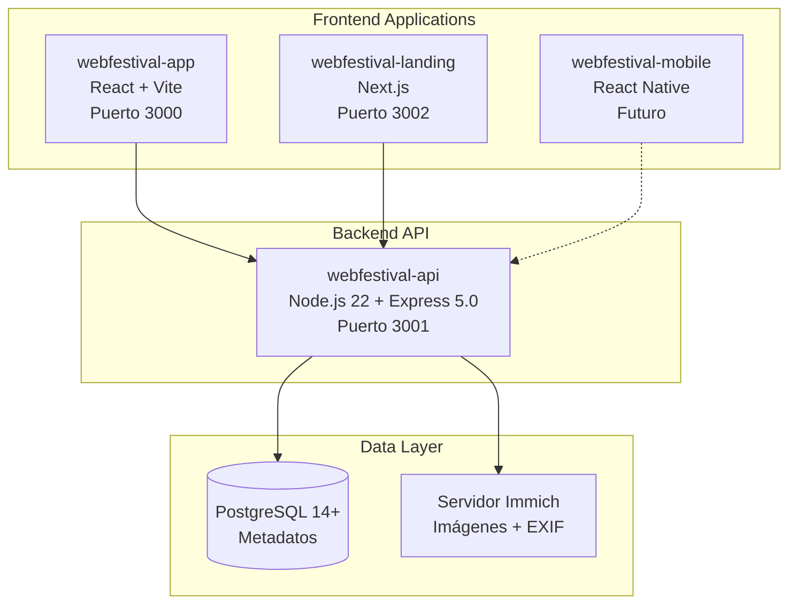

# WebFestival - Ecosistema de Concursos Multimedia

Un ecosistema completo de aplicaciones para la gestión de concursos multimedia online, dividido en tres proyectos independientes pero interconectados que conectan creadores de contenido (fotógrafos, videomakers, productores de audio y cineastas), jurados profesionales y organizadores en un ambiente colaborativo y competitivo.

## 🎯 Visión del Proyecto

WebFestival es un ecosistema de aplicaciones diseñado para ser la plataforma líder en concursos multimedia online, facilitando el descubrimiento de talento creativo emergente en múltiples disciplinas (fotografía, video, audio, cine) y creando una comunidad activa de creadores y profesionales del sector con contenido educativo continuo.

## 🚀 Características Principales

### Para Fotógrafos
- ✨ Plataforma profesional para mostrar talento
- 🏆 Participación en concursos especializados
- 👥 Comunidad activa y networking
- 📊 Feedback profesional de jurados expertos

### Para Jurados
- 🎯 Herramientas especializadas de evaluación
- 📝 Sistema de calificación multi-criterio
- 💬 Feedback constructivo a participantes
- 📈 Dashboard de progreso de evaluaciones

### Para Administradores
- 🎛️ Sistema completo de gestión de concursos
- 📊 Métricas y analytics avanzados
- 👤 Gestión de usuarios y permisos
- 🎨 Mini CMS para contenido estático

## 🛠️ Arquitectura Multi-Proyecto

El ecosistema se divide en **3 aplicaciones independientes** que trabajan en conjunto:

### 🔧 webfestival-api (Backend API)
- **Runtime**: Node.js 22+
- **Framework**: Express.js 5.0+
- **Lenguaje**: TypeScript 5+
- **ORM**: Prisma 5+
- **Base de Datos**: PostgreSQL 14+
- **Autenticación**: JWT + bcryptjs
- **Validación**: Zod 3+
- **Testing**: Jest 29+ + Supertest
- **Puerto**: 3001 (desarrollo)

### ⚛️ webfestival-app (Frontend Aplicación)
- **Framework**: React 19+
- **Lenguaje**: TypeScript 5+
- **Build Tool**: Vite 5+
- **Routing**: React Router 6+
- **Estado**: Zustand 4+ o TanStack Query 5+
- **Estilos**: Bootstrap 5.3+ con React Bootstrap 2+
- **HTTP Client**: Axios 1.6+
- **Testing**: Vitest 1+ + React Testing Library 14+
- **Puerto**: 3000 (desarrollo)

### 🌐 webfestival-landing (Landing + CMS)
- **Framework**: Next.js 15+
- **Lenguaje**: TypeScript 5+
- **Estilos**: Bootstrap 5.3+ con React Bootstrap 2+
- **CMS**: Sistema personalizado consumiendo webfestival-api
- **SEO**: Next.js built-in optimizations + structured data
- **Puerto**: 3002 (desarrollo)

### 🔗 Servicios Compartidos
- **Almacenamiento**: [Immich Server](https://immich.app/) para gestión inteligente de imágenes
- **Notificaciones**: SendGrid/Resend para emails
- **Redes Sociales**: APIs de Facebook, Instagram, Twitter, LinkedIn

## 🏗️ Arquitectura del Ecosistema



### Beneficios de la Arquitectura:
- 🌐 **API-First**: Sirve múltiples clientes (web, móvil, futuras integraciones)
- 📱 **Escalabilidad Independiente**: Cada proyecto escala según sus necesidades
- 🔒 **Seguridad Centralizada**: Autenticación y autorización en el API
- 🚀 **Rendimiento Optimizado**: Separación de responsabilidades
- 🔧 **Mantenibilidad**: Desarrollo y deployment independientes

## 📁 Estructura del Ecosistema

```
webfestival-ecosystem/
├── .kiro/specs/webfestival-platform/    # Especificaciones del ecosistema
│   ├── requirements.md                  # 32 Requisitos funcionales detallados
│   ├── design.md                       # Diseño técnico y arquitectura
│   ├── project.md                      # Documentación completa del proyecto
│   ├── PRD.md                          # Product Requirements Document
│   └── tasks.md                        # Plan de implementación (4 fases)
├── webfestival-api/                    # Backend API (próximamente)
│   ├── src/
│   ├── prisma/
│   └── package.json
├── webfestival-app/                    # Frontend App (próximamente)
│   ├── src/
│   ├── public/
│   └── package.json
├── webfestival-landing/                # Landing + CMS (próximamente)
│   ├── app/
│   ├── components/
│   └── package.json
├── .gitignore
└── README.md                           # Este archivo
```

## 🎨 Funcionalidades Destacadas

### Sistema de Evaluación Avanzado
- **Enfoque**: Nitidez, profundidad de campo, precisión
- **Exposición**: Iluminación, contraste, balance de blancos
- **Composición**: Regla de tercios, balance, encuadre
- **Creatividad**: Originalidad, concepto, innovación
- **Impacto Visual**: Fuerza emocional, atractivo estético

### Gestión Inteligente de Medios Multimedia con Immich
- 🖼️ Servidor Immich independiente para almacenamiento optimizado de múltiples formatos
- 📏 Soporte para imágenes (JPEG, PNG, WebP), videos (MP4, WebM), audios (MP3, WAV, FLAC)
- 🔍 Extracción automática de metadatos (EXIF para imágenes, metadata para videos/audios)
- ⚡ Optimización automática con múltiples resoluciones según tipo de medio
- 🔒 URLs seguras y temporales para subida directa

### Sistema CMS Dinámico y Unificado
- ✏️ CMS unificado para múltiples tipos de contenido (página estática, blog, futuras extensiones)
- 🎨 Editor WYSIWYG con plantillas dinámicas por tipo de contenido
- �  Rol específico CONTENT_ADMIN para gestión de contenido
- 👀 Preview en tiempo real y control de versiones
- 🏷️ Sistema flexible de categorización y etiquetado
- 📊 Analytics unificado para todos los tipos de contenido
- 💌 Newsletter automático con digest semanal
- 🔄 Interacciones universales (likes, comentarios, reportes)

## 🚦 Roadmap de Desarrollo (4 Fases)

### Fase 1: Backend API (webfestival-api) - 4-5 meses
- [ ] **22 tareas principales** organizadas en 8 grupos
- [ ] API REST completa con Express.js 5.0+ y Prisma 5+
- [ ] Sistema de autenticación JWT con roles granulares
- [ ] Gestión completa de concursos multimedia (fotografía, video, audio, cine)
- [ ] Sistema de calificaciones dinámico con criterios configurables y ponderables
- [ ] Integración con Immich para almacenamiento inteligente
- [ ] Sistema CMS unificado para múltiples tipos de contenido
- [ ] Sistema de notificaciones y redes sociales
- [ ] Testing completo con Jest y Supertest
- [ ] Documentación con Swagger/OpenAPI 3.0

### Fase 2: Frontend App (webfestival-app) - 4-5 meses
- [ ] **15 tareas principales** organizadas en 7 grupos
- [ ] Aplicación React 19+ con Vite 5+ y TypeScript 5+
- [ ] Interfaces especializadas para todos los roles de usuario
- [ ] Dashboard completo para participantes y jurados
- [ ] Panel de administración con métricas avanzadas
- [ ] Sistema de comunidad y seguimientos entre usuarios
- [ ] Galería pública multimedia con reproductores integrados y filtros avanzados
- [ ] Testing con Vitest y React Testing Library

### Fase 3: Landing + CMS (webfestival-landing) - 3-4 meses
- [ ] **12 tareas principales** organizadas en 5 grupos
- [ ] Landing page optimizada para SEO con Next.js 15+
- [ ] Sistema CMS dinámico para administradores de contenido
- [ ] Blog de la comunidad fotográfica con interacciones
- [ ] Newsletter automático y gestión de suscripciones
- [ ] Optimización SEO avanzada con structured data
- [ ] Panel de moderación unificado

### Fase 4: Integración y Testing Final - 1-2 meses
- [ ] **4 tareas principales** de integración
- [ ] Testing de integración completa entre los 3 proyectos
- [ ] Optimización de rendimiento del ecosistema
- [ ] Deployment de producción de los 3 proyectos
- [ ] Configuración de monitoreo y logging distribuido

## 📊 Métricas de Éxito

### KPIs Principales
- 🎯 **Adopción**: 1,000 usuarios registrados en los primeros 6 meses
- � ***Engagement**: 70% de usuarios activos mensualmente
- 🔄 **Retención**: 60% de retención a 3 meses
- ⭐ **Calidad**: 4.5+ estrellas en satisfacción de usuarios
- 📧 **Blog**: 500 suscriptores al newsletter en 6 meses
- 📝 **Contenido**: 50+ posts publicados en el primer año

### Métricas Operacionales
- ⚡ Tiempo de respuesta de la plataforma (<2s)
- 📸 Número de fotografías subidas por concurso
- 👥 Tasa de finalización de concursos
- 📊 **Blog**: Tiempo promedio de lectura, tasa de comentarios
- 💌 **Newsletter**: Tasa de apertura (>25%), tasa de clics (>5%)

## 🤝 Contribución

Este ecosistema está en fase de especificación y diseño. Para contribuir:

1. **Revisa la documentación completa** en `.kiro/specs/webfestival-platform/`
2. **Consulta el PRD** para entender la visión completa del ecosistema
3. **Sigue las especificaciones técnicas** en `design.md` para la arquitectura
4. **Revisa el plan de implementación** en `tasks.md` (53+ tareas organizadas en 4 fases)
5. **Entiende los 32 requisitos funcionales** detallados en `requirements.md`

### Estructura de Desarrollo
- Cada proyecto tendrá su propio repositorio independiente
- Desarrollo paralelo de los 3 proyectos después de completar el API
- Testing de integración continua entre proyectos

## 📄 Documentación Completa

- [📋 **Requisitos Funcionales**](.kiro/specs/webfestival-platform/requirements.md) - 32 requisitos detallados con criterios de aceptación
- [🏗️ **Diseño Técnico**](.kiro/specs/webfestival-platform/design.md) - Arquitectura completa del ecosistema multi-proyecto
- [📖 **Documentación del Proyecto**](.kiro/specs/webfestival-platform/project.md) - Visión general y especificaciones técnicas
- [📊 **Product Requirements Document**](.kiro/specs/webfestival-platform/PRD.md) - Análisis de mercado, funcionalidades y roadmap
- [✅ **Plan de Implementación**](.kiro/specs/webfestival-platform/tasks.md) - 53+ tareas organizadas en 4 fases de desarrollo

### Resumen de la Documentación
- **Total de páginas**: 5 documentos principales
- **Requisitos funcionales**: 32 requisitos con criterios EARS
- **Tareas de implementación**: 53+ tareas organizadas en 4 fases
- **Duración estimada**: 12-16 meses de desarrollo
- **Arquitectura**: 3 proyectos independientes + servicios compartidos

## 📞 Contacto

Para más información sobre el proyecto WebFestival, consulta la documentación técnica o contacta al equipo de desarrollo.

## 🎯 Tipos de Usuario y Funcionalidades

### 🎨 Participantes (Creadores Multimedia)
- Registro y gestión de perfil personalizable
- Inscripción y participación en concursos activos
- Subida de medios multimedia (fotos, videos, audios, cortos) con límite de 3 por concurso
- Visualización de resultados y calificaciones detalladas adaptadas por tipo de medio
- Sistema de seguimiento y feed de actividades
- Comentarios en medios de la comunidad

### ⚖️ Jurados
- Panel especializado con categorías asignadas por tipo de medio
- Sistema de calificación dinámico con criterios configurables (1-10):
  - **Criterios por Fotografía**: Enfoque, Exposición, Composición, Creatividad, Impacto Visual
  - **Criterios por Video**: Narrativa, Técnica Visual, Audio, Creatividad, Impacto Emocional
  - **Criterios por Audio**: Calidad Técnica, Composición, Creatividad, Producción, Impacto Sonoro
  - **Criterios por Corto de Cine**: Narrativa, Dirección, Técnica, Creatividad, Impacto Cinematográfico
  - **Flexibilidad**: Los criterios se cargan dinámicamente según el tipo de medio
- Dashboard de progreso de evaluaciones
- Comentarios profesionales para feedback constructivo

### 👨‍💼 Administradores
- Dashboard con métricas generales en tiempo real
- CRUD completo de concursos y categorías
- **Gestión de criterios dinámicos**: Crear, editar y ponderar criterios por tipo de medio
- Gestión de usuarios y asignación de roles
- Asignación inteligente de jurados por especialización
- Analytics avanzados y reportes exportables
- Sistema de moderación y soporte

### ✍️ Administradores de Contenido (CONTENT_ADMIN)
- Gestión unificada del CMS dinámico
- Editor WYSIWYG para múltiples tipos de contenido
- Gestión del blog de la comunidad multimedia
- Moderación de comentarios y reportes
- Analytics del blog y newsletter
- Gestión de suscriptores del newsletter

---

## 📊 Ejemplo de Criterios Dinámicos

### Datos Iniciales del Sistema de Evaluación

El sistema incluye criterios preconfigurados que los administradores pueden modificar:

```sql
-- Criterios para Fotografía
INSERT INTO criterios (nombre, descripcion, tipo_medio, peso, orden) VALUES
('Enfoque', 'Nitidez, profundidad de campo, precisión', 'fotografia', 1.0, 1),
('Exposición', 'Iluminación, contraste, balance de blancos', 'fotografia', 1.0, 2),
('Composición', 'Regla de tercios, balance, encuadre', 'fotografia', 1.2, 3),
('Creatividad', 'Originalidad, concepto, innovación', 'fotografia', 1.5, 4),
('Impacto Visual', 'Fuerza emocional, atractivo estético', 'fotografia', 1.3, 5);

-- Criterios para Video
INSERT INTO criterios (nombre, descripcion, tipo_medio, peso, orden) VALUES
('Narrativa', 'Historia, estructura, desarrollo', 'video', 1.5, 1),
('Técnica Visual', 'Calidad de imagen, movimientos de cámara', 'video', 1.0, 2),
('Audio', 'Calidad de sonido, música, efectos', 'video', 1.2, 3),
('Creatividad', 'Originalidad, concepto, innovación', 'video', 1.3, 4),
('Impacto Emocional', 'Conexión con audiencia, mensaje', 'video', 1.4, 5);

-- Criterios para Audio
INSERT INTO criterios (nombre, descripcion, tipo_medio, peso, orden) VALUES
('Calidad Técnica', 'Claridad, balance, masterización', 'audio', 1.0, 1),
('Composición', 'Estructura musical, armonía, ritmo', 'audio', 1.4, 2),
('Creatividad', 'Originalidad, innovación sonora', 'audio', 1.5, 3),
('Producción', 'Arreglos, instrumentación, efectos', 'audio', 1.2, 4),
('Impacto Sonoro', 'Fuerza emocional, memorabilidad', 'audio', 1.3, 5);

-- Criterios para Corto de Cine
INSERT INTO criterios (nombre, descripcion, tipo_medio, peso, orden) VALUES
('Narrativa', 'Guión, estructura, desarrollo de personajes', 'corto_cine', 1.5, 1),
('Dirección', 'Visión artística, manejo de actores', 'corto_cine', 1.4, 2),
('Técnica', 'Cinematografía, edición, sonido', 'corto_cine', 1.0, 3),
('Creatividad', 'Originalidad, concepto, innovación', 'corto_cine', 1.3, 4),
('Impacto Cinematográfico', 'Fuerza narrativa, mensaje', 'corto_cine', 1.4, 5);

-- Criterios Universales (aplican a todos los tipos)
INSERT INTO criterios (nombre, descripcion, tipo_medio, peso, orden) VALUES
('Originalidad', 'Nivel de innovación y unicidad', NULL, 1.2, 1),
('Técnica General', 'Dominio técnico del medio', NULL, 1.0, 2),
('Mensaje', 'Claridad y fuerza del mensaje transmitido', NULL, 1.3, 3);
```

### Características del Sistema de Criterios

- **🎯 Dinámicos**: Los administradores pueden crear, editar y eliminar criterios
- **⚖️ Ponderables**: Cada criterio tiene un peso configurable para el cálculo final
- **🎨 Específicos**: Criterios pueden ser específicos por tipo de medio o universales
- **📊 Ordenables**: Control del orden de presentación en la interfaz de evaluación
- **🔄 Flexibles**: Activación/desactivación sin pérdida de datos históricos

---

**Estado del Proyecto**: 🔧 En Especificación y Diseño Completo  
**Última Actualización**: Septiembre 2025  
**Versión de Especificaciones**: 2.0 (Arquitectura Multi-Proyecto + Criterios Dinámicos)  
**Próximo Hito**: Inicio de Fase 1 - Backend API (webfestival-api)

### Paginas de Competencia
```
https://35awards.com/11th/welcome/upload/
```
###  Ejecucions del proyecto. 

✅ Configuración Completada
1. Estructura de Carpetas
✅ src/ - Código fuente principal
✅ routes/ - Rutas de la API
✅ middleware/ - Middleware personalizado
✅ services/ - Lógica de negocio
✅ types/ - Definiciones de TypeScript
✅ prisma/ - Configuración de base de datos
✅ tests/ - Archivos de pruebas
2. Dependencias Principales Instaladas
✅ Express.js 5.1.0+
✅ Prisma 5+ para ORM
✅ JWT para autenticación
✅ bcryptjs para hash de contraseñas
✅ Zod 3+ para validación
✅ TypeScript 5+ configurado
3. Archivos de Configuración Creados
✅ .eslintrc.js - Configuración de ESLint
✅ .prettierrc - Configuración de Prettier
✅ .prettierignore - Archivos ignorados por Prettier
✅ jest.config.js - Configuración de Jest para testing
✅ .gitignore - Archivos ignorados por Git
4. Variables de Entorno Configuradas
✅ .env.example - Plantilla de variables de entorno
✅ .env.test - Variables para testing
✅ Configuración para base de datos, Immich, servicios de email, redes sociales
5. Scripts de Desarrollo Configurados
✅ npm run dev - Servidor de desarrollo
✅ npm run build - Compilar TypeScript
✅ npm run test - Ejecutar pruebas con Jest
✅ npm run lint - Verificar código con ESLint
✅ npm run format - Formatear código con Prettier
6. Testing Configurado
✅ Jest 29+ con Supertest
✅ Archivo de configuración de pruebas
✅ Pruebas de ejemplo para endpoints básicos
✅ Configuración de cobertura de código