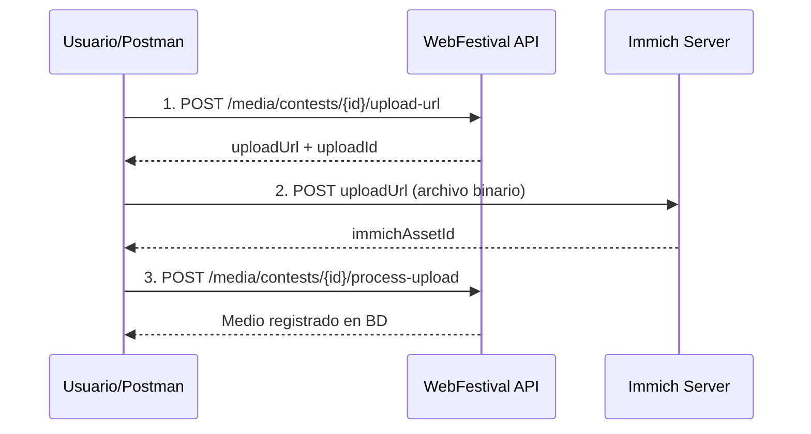

# 📤 Ejemplos de Subida de Archivos a Immich - WebFestival API

## 🎯 Flujo Completo de Subida de Archivos

La subida de archivos en WebFestival utiliza un flujo de **3 pasos** que integra con **Immich** para el almacenamiento seguro de medios:



## 🚀 Paso a Paso con Ejemplos de Postman

### Paso 1: Generar URL de Subida Segura

**Endpoint:** `POST /api/v1/media/contests/{concursoId}/upload-url`

```http
POST {{base_url}}/media/contests/1/upload-url
Authorization: Bearer {{access_token}}
Content-Type: application/json

{
  "titulo": "Mi Fotografía Urbana",
  "tipo_medio": "fotografia",
  "categoria_id": 1,
  "formato": "image/jpeg",
  "tamaño_archivo": 2048576
}
```

**Respuesta esperada:**
```json
{
  "success": true,
  "data": {
    "uploadUrl": "http://localhost:2283/api/assets",
    "uploadId": "upload_1234567890",
    "headers": {
      "x-api-key": "temp_api_key_xyz789",
      "Content-Type": "multipart/form-data"
    },
    "maxFileSize": 10485760,
    "allowedFormats": ["image/jpeg", "image/png", "image/webp"]
  }
}
```

**Script de Postman para capturar variables:**
```javascript
if (pm.response.code === 200) {
    const response = pm.response.json();
    pm.environment.set('upload_url', response.data.uploadUrl);
    pm.environment.set('upload_id', response.data.uploadId);
    pm.environment.set('immich_api_key', response.data.headers['x-api-key']);
    console.log('✅ URL de subida generada:', response.data.uploadUrl);
    console.log('📝 Upload ID:', response.data.uploadId);
}
```

### Paso 2: Subir Archivo a Immich

**⚠️ IMPORTANTE:** Este es el paso que faltaba en las colecciones existentes.

**Endpoint:** `POST {{upload_url}}` (URL generada por Immich)

#### 📸 Ejemplo para Fotografía

```http
POST {{upload_url}}
x-api-key: {{immich_api_key}}
Content-Type: multipart/form-data

# En el Body, seleccionar "form-data" y agregar:
# Key: "assetData" | Type: File | Value: [Seleccionar archivo .jpg/.png]
# Key: "deviceAssetId" | Type: Text | Value: "{{upload_id}}"
# Key: "deviceId" | Type: Text | Value: "webfestival-api"
# Key: "fileCreatedAt" | Type: Text | Value: "2025-01-15T10:30:00.000Z"
# Key: "fileModifiedAt" | Type: Text | Value: "2025-01-15T10:30:00.000Z"
```

**Configuración en Postman:**
1. **Method:** POST
2. **URL:** `{{upload_url}}`
3. **Headers:**
   - `x-api-key: {{immich_api_key}}`
4. **Body:** form-data
   - `assetData`: [File] - Seleccionar tu archivo de imagen
   - `deviceAssetId`: [Text] - `{{upload_id}}`
   - `deviceId`: [Text] - `webfestival-api`
   - `fileCreatedAt`: [Text] - `2025-01-15T10:30:00.000Z`
   - `fileModifiedAt`: [Text] - `2025-01-15T10:30:00.000Z`

#### 🎬 Ejemplo para Video

```http
POST {{upload_url}}
x-api-key: {{immich_api_key}}
Content-Type: multipart/form-data

# En el Body, seleccionar "form-data" y agregar:
# Key: "assetData" | Type: File | Value: [Seleccionar archivo .mp4/.mov]
# Key: "deviceAssetId" | Type: Text | Value: "{{upload_id}}"
# Key: "deviceId" | Type: Text | Value: "webfestival-api"
# Key: "fileCreatedAt" | Type: Text | Value: "2025-01-15T10:30:00.000Z"
# Key: "fileModifiedAt" | Type: Text | Value: "2025-01-15T10:30:00.000Z"
```

#### 🎵 Ejemplo para Audio

```http
POST {{upload_url}}
x-api-key: {{immich_api_key}}
Content-Type: multipart/form-data

# En el Body, seleccionar "form-data" y agregar:
# Key: "assetData" | Type: File | Value: [Seleccionar archivo .mp3/.wav]
# Key: "deviceAssetId" | Type: Text | Value: "{{upload_id}}"
# Key: "deviceId" | Type: Text | Value: "webfestival-api"
# Key: "fileCreatedAt" | Type: Text | Value: "2025-01-15T10:30:00.000Z"
# Key: "fileModifiedAt" | Type: Text | Value: "2025-01-15T10:30:00.000Z"
```

**Respuesta esperada de Immich:**
```json
{
  "id": "asset-uuid-123-456-789",
  "deviceAssetId": "upload_1234567890",
  "ownerId": "user-uuid-abc-def",
  "deviceId": "webfestival-api",
  "originalPath": "/upload/library/user-uuid/2025/01/15/asset-uuid-123-456-789.jpg",
  "originalFileName": "mi-fotografia.jpg",
  "type": "IMAGE",
  "fileCreatedAt": "2025-01-15T10:30:00.000Z",
  "fileModifiedAt": "2025-01-15T10:30:00.000Z",
  "updatedAt": "2025-01-15T10:30:15.123Z",
  "isFavorite": false,
  "isArchived": false,
  "duration": "00:00:00.000000",
  "exifInfo": null,
  "smartInfo": null,
  "livePhotoVideoId": null,
  "tags": []
}
```

**Script de Postman para capturar el Asset ID:**
```javascript
if (pm.response.code === 201) {
    const response = pm.response.json();
    pm.environment.set('immich_asset_id', response.id);
    console.log('✅ Archivo subido a Immich');
    console.log('📝 Asset ID:', response.id);
    console.log('📁 Ruta:', response.originalPath);
} else {
    console.error('❌ Error subiendo archivo:', pm.response.text());
}
```

### Paso 3: Procesar Subida Completada

**Endpoint:** `POST /api/v1/media/contests/{concursoId}/process-upload`

```http
POST {{base_url}}/media/contests/1/process-upload
Authorization: Bearer {{access_token}}
Content-Type: application/json

{
  "uploadId": "{{upload_id}}",
  "immichAssetId": "{{immich_asset_id}}"
}
```

**Respuesta esperada:**
```json
{
  "success": true,
  "data": {
    "id": 123,
    "titulo": "Mi Fotografía Urbana",
    "tipo_medio": "fotografia",
    "categoria_id": 1,
    "usuario_id": 456,
    "concurso_id": 1,
    "immich_asset_id": "asset-uuid-123-456-789",
    "url_publica": "https://webfestival.com/media/123",
    "url_thumbnail": "https://immich.webfestival.com/api/assets/asset-uuid-123-456-789/thumbnail",
    "estado": "activo",
    "fecha_subida": "2025-01-15T10:30:15.123Z",
    "metadatos": {
      "formato": "image/jpeg",
      "tamaño_archivo": 2048576,
      "dimensiones": "1920x1080"
    }
  },
  "message": "Medio registrado exitosamente"
}
```

## 🔧 Configuración de Variables de Entorno

Asegúrate de tener estas variables en tu entorno de Postman:

```json
{
  "base_url": "http://localhost:3001/api/v1",
  "server_url": "http://localhost:3001",
  "immich_url": "http://localhost:2283",
  "access_token": "",
  "upload_url": "",
  "upload_id": "",
  "immich_api_key": "",
  "immich_asset_id": "",
  "concurso_id": "1"
}
```

## 📋 Colección Completa de Postman

### Request 1: Generar URL de Subida
```json
{
  "name": "1. Generar URL de Subida - Fotografía",
  "request": {
    "method": "POST",
    "header": [
      {
        "key": "Authorization",
        "value": "Bearer {{access_token}}"
      },
      {
        "key": "Content-Type",
        "value": "application/json"
      }
    ],
    "body": {
      "mode": "raw",
      "raw": "{\n  \"titulo\": \"Mi Fotografía Urbana\",\n  \"tipo_medio\": \"fotografia\",\n  \"categoria_id\": 1,\n  \"formato\": \"image/jpeg\",\n  \"tamaño_archivo\": 2048576\n}"
    },
    "url": {
      "raw": "{{base_url}}/media/contests/{{concurso_id}}/upload-url",
      "host": ["{{base_url}}"],
      "path": ["media", "contests", "{{concurso_id}}", "upload-url"]
    }
  },
  "event": [
    {
      "listen": "test",
      "script": {
        "exec": [
          "if (pm.response.code === 200) {",
          "    const response = pm.response.json();",
          "    pm.environment.set('upload_url', response.data.uploadUrl);",
          "    pm.environment.set('upload_id', response.data.uploadId);",
          "    pm.environment.set('immich_api_key', response.data.headers['x-api-key']);",
          "    console.log('✅ URL de subida generada');",
          "}"
        ]
      }
    }
  ]
}
```

### Request 2: Subir Archivo a Immich
```json
{
  "name": "2. Subir Archivo a Immich",
  "request": {
    "method": "POST",
    "header": [
      {
        "key": "x-api-key",
        "value": "{{immich_api_key}}"
      }
    ],
    "body": {
      "mode": "formdata",
      "formdata": [
        {
          "key": "assetData",
          "type": "file",
          "src": []
        },
        {
          "key": "deviceAssetId",
          "value": "{{upload_id}}",
          "type": "text"
        },
        {
          "key": "deviceId",
          "value": "webfestival-api",
          "type": "text"
        },
        {
          "key": "fileCreatedAt",
          "value": "2025-01-15T10:30:00.000Z",
          "type": "text"
        },
        {
          "key": "fileModifiedAt",
          "value": "2025-01-15T10:30:00.000Z",
          "type": "text"
        }
      ]
    },
    "url": {
      "raw": "{{upload_url}}",
      "host": ["{{upload_url}}"]
    }
  },
  "event": [
    {
      "listen": "test",
      "script": {
        "exec": [
          "if (pm.response.code === 201) {",
          "    const response = pm.response.json();",
          "    pm.environment.set('immich_asset_id', response.id);",
          "    console.log('✅ Archivo subido a Immich:', response.id);",
          "} else {",
          "    console.error('❌ Error:', pm.response.text());",
          "}"
        ]
      }
    }
  ]
}
```

### Request 3: Procesar Subida
```json
{
  "name": "3. Procesar Subida Completada",
  "request": {
    "method": "POST",
    "header": [
      {
        "key": "Authorization",
        "value": "Bearer {{access_token}}"
      },
      {
        "key": "Content-Type",
        "value": "application/json"
      }
    ],
    "body": {
      "mode": "raw",
      "raw": "{\n  \"uploadId\": \"{{upload_id}}\",\n  \"immichAssetId\": \"{{immich_asset_id}}\"\n}"
    },
    "url": {
      "raw": "{{base_url}}/media/contests/{{concurso_id}}/process-upload",
      "host": ["{{base_url}}"],
      "path": ["media", "contests", "{{concurso_id}}", "process-upload"]
    }
  }
}
```

## 🎯 Casos de Uso por Tipo de Medio

### 📸 Fotografía (JPEG, PNG, WebP)
- **Tamaño máximo:** 10 MB
- **Formatos:** `image/jpeg`, `image/png`, `image/webp`
- **Validaciones:** Dimensiones mínimas, calidad de imagen

### 🎬 Video (MP4, WebM, MOV)
- **Tamaño máximo:** 100 MB
- **Formatos:** `video/mp4`, `video/webm`, `video/mov`
- **Validaciones:** Duración máxima, resolución, codec

### 🎵 Audio (MP3, WAV, FLAC)
- **Tamaño máximo:** 50 MB
- **Formatos:** `audio/mp3`, `audio/wav`, `audio/flac`
- **Validaciones:** Duración máxima, bitrate, frecuencia

### 🎭 Corto de Cine (MP4, MOV)
- **Tamaño máximo:** 500 MB
- **Formatos:** `video/mp4`, `video/mov`
- **Validaciones:** Duración específica, calidad profesional

## 🐛 Troubleshooting

### Error 400: "Invalid file format"
**Causa:** El archivo no tiene el formato especificado en el paso 1
**Solución:** Verificar que el archivo real coincida con el `formato` enviado

### Error 413: "File too large"
**Causa:** El archivo excede el límite del tipo de medio
**Solución:** Comprimir el archivo o verificar límites con `/media/validation-config`

### Error 401: "Invalid API key"
**Causa:** La API key temporal de Immich expiró
**Solución:** Generar nueva URL de subida (paso 1)

### Error 404: "Upload URL not found"
**Causa:** La URL de subida expiró (válida por 15 minutos)
**Solución:** Generar nueva URL de subida

### Error 422: "Asset already exists"
**Causa:** El `deviceAssetId` ya fue usado
**Solución:** Generar nuevo `upload_id` con una nueva URL

## 🔒 Consideraciones de Seguridad

1. **API Keys temporales:** Las claves de Immich expiran en 15 minutos
2. **URLs firmadas:** Las URLs de subida son de un solo uso
3. **Validación de archivos:** Todos los archivos son escaneados por malware
4. **Límites de usuario:** Respetan los límites del plan de suscripción

## 📊 Monitoreo y Logs

### Verificar Estado de Immich
```http
GET {{server_url}}/health/immich
```

### Ver Logs de Subida
```http
GET {{base_url}}/media/upload-logs?uploadId={{upload_id}}
Authorization: Bearer {{access_token}}
```

## 🚀 Automatización con Newman

```bash
# Ejecutar flujo completo de subida
newman run WebFestival-Upload-Complete.postman_collection.json \
  -e WebFestival-Development.postman_environment.json \
  --folder "Flujo Completo de Subida"
```

---

**¡Con estos ejemplos ya puedes subir archivos completos a Immich desde Postman! 📤✨**