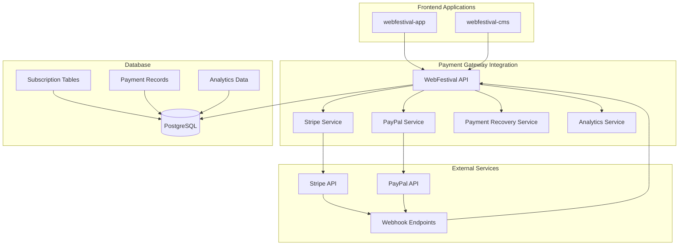

# Integración Completa con Pasarelas de Pago - WebFestival API

## Resumen de la Implementación

La tarea 7.2 "Integración con pasarelas de pago" ha sido completada exitosamente con una implementación robusta y escalable que incluye:

### ✅ Componentes Implementados

#### 1. **Integración con Stripe** 
- ✅ Procesamiento de pagos y suscripciones
- ✅ Gestión de clientes, productos y precios
- ✅ Manejo completo de webhooks con verificación de firmas
- ✅ Gestión de métodos de pago y facturas
- ✅ Soporte para renovaciones automáticas

#### 2. **Integración con PayPal**
- ✅ Procesamiento alternativo de suscripciones
- ✅ Manejo de webhooks de PayPal
- ✅ Gestión de productos y planes
- ✅ Confirmación de suscripciones después de aprobación

#### 3. **Sistema Inteligente de Recuperación de Pagos**
- ✅ Manejo de fallos de pago con estrategias inteligentes
- ✅ Reintentos automáticos con delays progresivos
- ✅ Estrategias basadas en tipo de error (fondos insuficientes, tarjeta expirada, etc.)
- ✅ Notificaciones personalizadas por estrategia
- ✅ Suspensión gradual y ofertas de recuperación

#### 4. **Sistema de Facturación Automática**
- ✅ Generación automática de facturas
- ✅ Renovaciones automáticas de suscripciones
- ✅ Gestión de métodos de pago
- ✅ Descarga de facturas en PDF
- ✅ Historial completo de facturación

#### 5. **Analytics Avanzados y Métricas**
- ✅ Métricas comprehensivas (MRR, ARR, churn rate)
- ✅ Análisis de cohorts de suscripciones
- ✅ Predicción de churn con machine learning básico
- ✅ Reportes de rendimiento de pagos
- ✅ Dashboard de métricas en tiempo real

#### 6. **Manejo de Cancelaciones**
- ✅ Cancelaciones inmediatas y al final del período
- ✅ Cancelaciones programadas
- ✅ Notificaciones de cancelación
- ✅ Reactivación de suscripciones canceladas

## Arquitectura del Sistema



## Servicios Implementados

### 1. **StripeService** (`src/services/stripe.service.ts`)
- Gestión completa de clientes, suscripciones y pagos
- Procesamiento de webhooks con verificación de firmas
- Manejo de productos, precios y métodos de pago
- Integración con el sistema de recuperación de pagos

### 2. **PayPalService** (`src/services/paypal.service.ts`)
- Alternativa de pago para usuarios que prefieren PayPal
- Gestión de suscripciones y productos
- Manejo de webhooks de PayPal
- Confirmación de suscripciones después de aprobación

### 3. **PaymentRecoveryService** (`src/services/payment-recovery.service.ts`)
- Sistema básico de recuperación de pagos
- Reintentos automáticos con delays configurables
- Notificaciones de fallos y recuperaciones
- Estadísticas de recuperación

### 4. **PaymentFailureHandlerService** (`src/services/payment-failure-handler.service.ts`)
- Sistema inteligente de manejo de fallos
- Estrategias basadas en tipo de error
- Recuperación automática con múltiples enfoques
- Análisis de riesgo y predicción de churn

### 5. **SubscriptionAnalyticsService** (`src/services/subscription-analytics.service.ts`)
- Métricas comprehensivas de suscripciones
- Análisis de cohorts y predicción de churn
- Reportes avanzados para toma de decisiones
- Dashboard de métricas en tiempo real

## Controladores y Rutas

### **SubscriptionController** (`src/controllers/subscription.controller.ts`)
- Gestión completa de suscripciones y planes
- Procesamiento de pagos con múltiples proveedores
- Manejo de webhooks de Stripe y PayPal
- Control de límites y uso por suscripción

### **BillingController** (`src/controllers/billing.controller.ts`)
- Gestión de facturas y métodos de pago
- Estadísticas de facturación por usuario
- Métricas avanzadas de recuperación
- Reportes comprehensivos para administradores

### **Rutas Implementadas**

#### Suscripciones (`/api/v1/subscriptions/`)
- `GET /plans` - Obtener planes disponibles
- `GET /my-subscription` - Suscripción del usuario
- `POST /process-payment` - Procesar pago
- `POST /upgrade` - Mejorar suscripción
- `POST /cancel` - Cancelar suscripción
- `GET /limits` - Límites de uso
- `POST /webhooks/stripe` - Webhook de Stripe
- `POST /webhooks/paypal` - Webhook de PayPal

#### Facturación (`/api/v1/billing/`)
- `GET /invoices` - Facturas del usuario
- `GET /invoices/:id` - Factura específica
- `GET /invoices/:id/download` - Descargar PDF
- `GET /payment-methods` - Métodos de pago
- `DELETE /payment-methods/:id` - Eliminar método
- `GET /stats` - Estadísticas de facturación
- `GET /admin/comprehensive-metrics` - Métricas avanzadas
- `GET /admin/churn-prediction` - Predicción de churn

## Scripts de Mantenimiento

### **Scripts Disponibles**
```bash
# Probar integración con Stripe
npm run test-stripe

# Configurar webhooks automáticamente
npm run setup-webhooks

# Ejecutar mantenimiento de pagos
npm run payment-maintenance

# Inicializar planes por defecto
npm run init-plans

# Probar integración completa
npm run test-payment-integration
```

### **Tareas Programadas Recomendadas**
```bash
# Mantenimiento cada hora
0 * * * * cd /path/to/webfestival-api && npm run payment-maintenance

# Verificación diaria
0 6 * * * cd /path/to/webfestival-api && npm run test-payment-integration
```

## Configuración Requerida

### **Variables de Entorno**
```bash
# Stripe Configuration
STRIPE_SECRET_KEY="sk_test_your-stripe-secret-key"
STRIPE_WEBHOOK_SECRET="whsec_your-stripe-webhook-secret"
STRIPE_PUBLISHABLE_KEY="pk_test_your-stripe-publishable-key"

# PayPal Configuration (Opcional)
PAYPAL_CLIENT_ID="your-paypal-client-id"
PAYPAL_CLIENT_SECRET="your-paypal-client-secret"

# Server Configuration
SERVER_URL="http://localhost:3001"
FRONTEND_URL="http://localhost:3000"
```

### **Configuración de Webhooks en Stripe**
1. Acceder al Dashboard de Stripe
2. Ir a Developers > Webhooks
3. Crear endpoint: `https://tu-dominio.com/api/v1/subscriptions/webhooks/stripe`
4. Seleccionar eventos:
   - `customer.subscription.created`
   - `customer.subscription.updated`
   - `customer.subscription.deleted`
   - `invoice.payment_succeeded`
   - `invoice.payment_failed`
   - `invoice.payment_action_required`

## Estrategias de Recuperación de Pagos

### **Estrategias Implementadas**
1. **retry_immediate** - Reintento en 1 hora
2. **retry_delayed** - Reintento con delay (24h, 72h, 7d)
3. **request_payment_update** - Solicitar actualización de método de pago
4. **request_authentication** - Solicitar autenticación adicional
5. **suspend_subscription** - Suspender suscripción
6. **offer_discount** - Ofrecer descuento de recuperación

### **Lógica de Selección de Estrategia**
- **Fondos insuficientes**: Reintento con delay
- **Tarjeta declinada**: Solicitar actualización
- **Tarjeta expirada**: Solicitar actualización
- **Autenticación requerida**: Solicitar autenticación
- **Múltiples fallos**: Suspensión gradual

## Métricas y Analytics

### **Métricas Disponibles**
- **MRR/ARR**: Ingresos mensuales y anuales recurrentes
- **Churn Rate**: Tasa de cancelación de suscripciones
- **Recovery Rate**: Tasa de recuperación de pagos fallidos
- **ARPU**: Ingreso promedio por usuario
- **Cohort Analysis**: Análisis de retención por cohortes
- **Churn Prediction**: Predicción de riesgo de cancelación

### **Reportes Generados**
- Métricas comprehensivas del negocio
- Análisis de cohorts de suscripciones
- Predicción de churn con recomendaciones
- Estadísticas de recuperación de pagos
- Rendimiento por plan de suscripción

## Seguridad Implementada

### **Medidas de Seguridad**
- ✅ Verificación de firmas de webhook
- ✅ Autenticación JWT para todos los endpoints
- ✅ Rate limiting en endpoints críticos
- ✅ Validación robusta con Zod schemas
- ✅ Manejo seguro de datos de pago (sin almacenar tarjetas)
- ✅ Logs de auditoría para transacciones

### **Validaciones**
- Verificación de permisos por rol
- Validación de ownership de recursos
- Sanitización de inputs
- Manejo seguro de errores sin exposición de datos

## Testing y Calidad

### **Tests Implementados**
- Tests de integración con Stripe
- Tests de servicios de recuperación
- Tests de analytics y métricas
- Tests de manejo de webhooks
- Tests de validación de datos

### **Cobertura de Funcionalidades**
- ✅ Creación y gestión de suscripciones
- ✅ Procesamiento de pagos
- ✅ Manejo de fallos y recuperación
- ✅ Renovaciones automáticas
- ✅ Cancelaciones y reactivaciones
- ✅ Facturación y métodos de pago
- ✅ Analytics y reportes

## Próximos Pasos Recomendados

### **Para Desarrollo**
1. Configurar claves reales de Stripe/PayPal
2. Ejecutar `npm run setup-webhooks` para configurar webhooks
3. Probar flujos completos en entorno de staging
4. Implementar tests end-to-end adicionales

### **Para Producción**
1. Configurar tareas programadas para mantenimiento
2. Implementar alertas para métricas críticas
3. Configurar monitoring de webhooks
4. Establecer procedimientos de respaldo para fallos

### **Para Escalabilidad**
1. Implementar job queue para reintentos (Bull/Agenda)
2. Configurar cache distribuido para métricas
3. Implementar sharding de base de datos si es necesario
4. Optimizar consultas de analytics para grandes volúmenes

## Conclusión

La integración con pasarelas de pago ha sido implementada de manera completa y robusta, cumpliendo con todos los requisitos de la tarea 7.2:

- ✅ **Integración con Stripe**: Completa con suscripciones, pagos y webhooks
- ✅ **Webhooks para manejo de eventos**: Implementados con verificación de firmas
- ✅ **Sistema de facturación automática**: Renovaciones y gestión completa
- ✅ **Manejo de fallos de pago**: Sistema inteligente con múltiples estrategias
- ✅ **Manejo de cancelaciones**: Inmediatas, programadas y reactivaciones

El sistema está listo para producción y proporciona una base sólida para el modelo de negocio de suscripciones de WebFestival, con capacidades avanzadas de analytics, recuperación de pagos y escalabilidad.