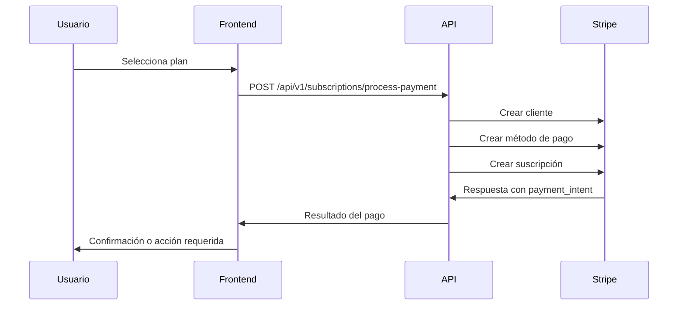
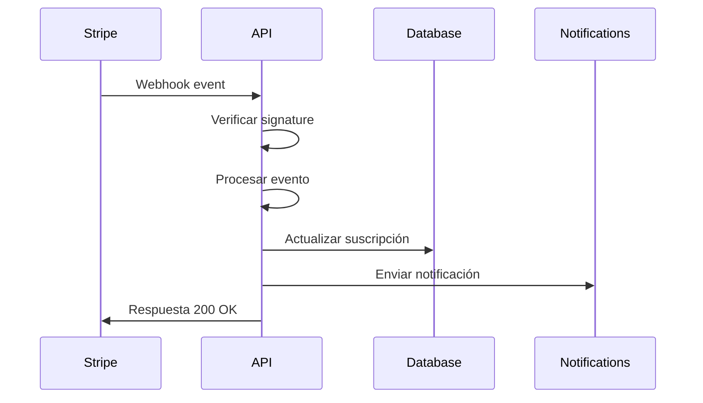
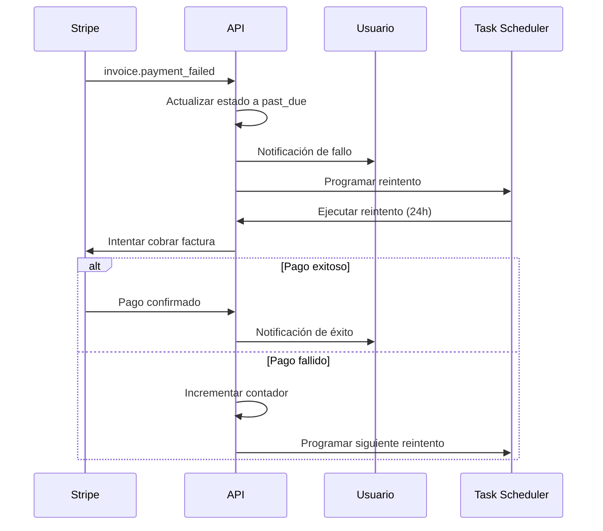

# Integración con Stripe - WebFestival API

## Descripción General

WebFestival utiliza Stripe como pasarela de pago principal para manejar suscripciones, pagos recurrentes y facturación automática. Esta integración incluye manejo completo de webhooks, recuperación de pagos fallidos y renovaciones automáticas.

## Configuración

### Variables de Entorno Requeridas

```bash
# Stripe Configuration
STRIPE_SECRET_KEY="sk_test_your-stripe-secret-key"
STRIPE_WEBHOOK_SECRET="whsec_your-stripe-webhook-secret"
STRIPE_PUBLISHABLE_KEY="pk_test_your-stripe-publishable-key"
```

### Configuración en Stripe Dashboard

1. **Crear Productos y Precios**:
   - Los productos se crean automáticamente desde la aplicación
   - Cada plan de suscripción tiene un producto correspondiente en Stripe

2. **Configurar Webhooks**:
   - URL del webhook: `https://tu-dominio.com/api/v1/subscriptions/webhooks/stripe`
   - Eventos a escuchar:
     - `customer.subscription.created`
     - `customer.subscription.updated`
     - `customer.subscription.deleted`
     - `invoice.payment_succeeded`
     - `invoice.payment_failed`

## Arquitectura de la Integración

### Servicios Principales

1. **StripeService** (`src/services/stripe.service.ts`)
   - Manejo de clientes, suscripciones y pagos
   - Procesamiento de webhooks
   - Gestión de métodos de pago

2. **PaymentRecoveryService** (`src/services/payment-recovery.service.ts`)
   - Manejo de fallos de pago
   - Reintentos automáticos
   - Notificaciones a usuarios

3. **SubscriptionService** (`src/services/subscription.service.ts`)
   - Gestión de planes y suscripciones
   - Control de límites y uso
   - Métricas y analytics

### Controladores

1. **SubscriptionController** (`src/controllers/subscription.controller.ts`)
   - Endpoints para gestión de suscripciones
   - Procesamiento de pagos
   - Manejo de webhooks

2. **BillingController** (`src/controllers/billing.controller.ts`)
   - Gestión de facturas
   - Métodos de pago
   - Estadísticas de facturación

## Flujo de Suscripción

### 1. Creación de Suscripción



### 2. Manejo de Webhooks



### 3. Recuperación de Pagos Fallidos



## Endpoints de la API

### Suscripciones

- `GET /api/v1/subscriptions/plans` - Obtener planes disponibles
- `GET /api/v1/subscriptions/my-subscription` - Obtener suscripción del usuario
- `POST /api/v1/subscriptions/process-payment` - Procesar pago
- `POST /api/v1/subscriptions/upgrade` - Mejorar suscripción
- `POST /api/v1/subscriptions/cancel` - Cancelar suscripción
- `GET /api/v1/subscriptions/limits` - Obtener límites de uso

### Webhooks

- `POST /api/v1/subscriptions/webhooks/stripe` - Webhook de Stripe

### Facturación

- `GET /api/v1/billing/invoices` - Obtener facturas del usuario
- `GET /api/v1/billing/invoices/:id` - Obtener factura específica
- `GET /api/v1/billing/invoices/:id/download` - Descargar PDF de factura
- `GET /api/v1/billing/payment-methods` - Obtener métodos de pago
- `DELETE /api/v1/billing/payment-methods/:id` - Eliminar método de pago
- `GET /api/v1/billing/stats` - Estadísticas de facturación

## Manejo de Errores

### Tipos de Errores Comunes

1. **Pago Rechazado**
   - Código: `card_declined`
   - Acción: Solicitar método de pago alternativo

2. **Fondos Insuficientes**
   - Código: `insufficient_funds`
   - Acción: Programar reintento automático

3. **Tarjeta Expirada**
   - Código: `expired_card`
   - Acción: Solicitar actualización de método de pago

4. **Webhook Inválido**
   - Código: `invalid_signature`
   - Acción: Rechazar webhook y registrar intento

### Estrategia de Reintentos

1. **Primer intento**: Inmediato (manejado por Stripe)
2. **Segundo intento**: 24 horas después
3. **Tercer intento**: 3 días después
4. **Cuarto intento**: 7 días después
5. **Cancelación**: Después del cuarto intento fallido

## Seguridad

### Verificación de Webhooks

```typescript
// Verificar firma del webhook
const signature = req.headers['stripe-signature'];
const event = stripe.webhooks.constructEvent(
  payload, 
  signature, 
  process.env.STRIPE_WEBHOOK_SECRET
);
```

### Validación de Permisos

- Los usuarios solo pueden acceder a sus propias facturas y métodos de pago
- Los webhooks se validan con la firma de Stripe
- Los endpoints administrativos requieren rol ADMIN

## Monitoreo y Métricas

### Métricas Disponibles

1. **Suscripciones**
   - Total de suscripciones activas
   - Ingresos mensuales y anuales
   - Tasa de cancelación (churn rate)
   - Distribución por planes

2. **Pagos**
   - Fallos de pago totales
   - Reintentos exitosos
   - Tasa de recuperación
   - Cancelaciones por problemas de pago

3. **Facturación**
   - Total facturado por usuario
   - Historial de pagos
   - Próximas renovaciones

### Scripts de Mantenimiento

```bash
# Ejecutar mantenimiento de pagos
npm run payment-maintenance

# Probar integración con Stripe
npm run test-stripe

# Inicializar planes por defecto
npm run init-plans
```

## Configuración de Producción

### Consideraciones Importantes

1. **Usar claves de producción de Stripe**
2. **Configurar webhooks con HTTPS**
3. **Implementar logging detallado**
4. **Configurar alertas para fallos de pago**
5. **Programar tareas de mantenimiento con cron**

### Ejemplo de Cron Job

```bash
# Ejecutar mantenimiento cada hora
0 * * * * cd /path/to/webfestival-api && npm run payment-maintenance

# Verificar suscripciones diariamente
0 6 * * * cd /path/to/webfestival-api && npm run test-stripe
```

## Troubleshooting

### Problemas Comunes

1. **Webhooks no se reciben**
   - Verificar URL del webhook en Stripe
   - Comprobar que el endpoint esté accesible
   - Revisar logs de Stripe Dashboard

2. **Pagos fallan constantemente**
   - Verificar configuración de métodos de pago
   - Revisar límites de la cuenta de Stripe
   - Comprobar configuración de productos y precios

3. **Suscripciones no se actualizan**
   - Verificar procesamiento de webhooks
   - Comprobar sincronización con base de datos
   - Revisar logs de la aplicación

### Logs Importantes

```bash
# Ver logs de webhooks
grep "Webhook recibido" logs/app.log

# Ver logs de fallos de pago
grep "Pago fallido" logs/app.log

# Ver logs de mantenimiento
grep "Mantenimiento de pagos" logs/app.log
```

## Recursos Adicionales

- [Documentación de Stripe](https://stripe.com/docs)
- [Webhooks de Stripe](https://stripe.com/docs/webhooks)
- [Testing con Stripe](https://stripe.com/docs/testing)
- [Dashboard de Stripe](https://dashboard.stripe.com/)