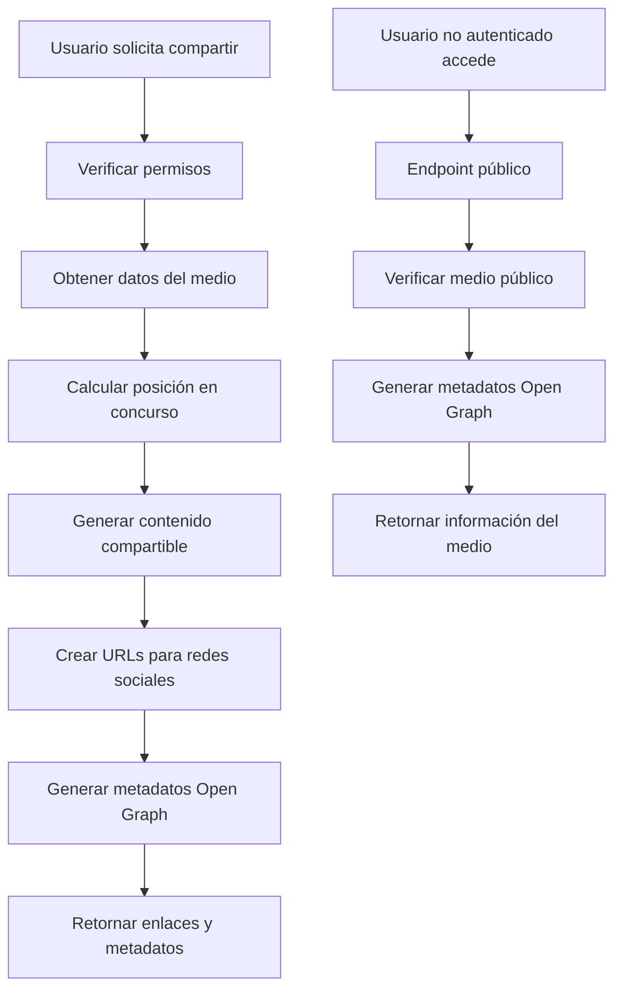

# Sistema de Integración con Redes Sociales - WebFestival API

## Descripción General

El sistema de integración con redes sociales permite a los participantes compartir sus medios ganadores en Facebook, Instagram, Twitter y LinkedIn. Implementa generación automática de enlaces compartibles, metadatos Open Graph para previews optimizados y hashtags relevantes según el tipo de medio y concurso.

## Arquitectura y Componentes

### Componentes Principales

1. **SocialMediaService**: Servicio principal que maneja toda la lógica de generación de contenido
2. **SocialMediaController**: Controlador REST que expone los endpoints
3. **OpenGraphMiddleware**: Middleware para generar metadatos dinámicos
4. **Rutas protegidas**: Endpoints con autenticación y rate limiting

### Flujo de Funcionamiento



## Configuración

### Variables de Entorno Requeridas

```bash
# APIs de Redes Sociales
FACEBOOK_APP_ID="your-facebook-app-id"
FACEBOOK_APP_SECRET="your-facebook-app-secret"
INSTAGRAM_ACCESS_TOKEN="your-instagram-access-token"
TWITTER_API_KEY="your-twitter-api-key"
TWITTER_API_SECRET="your-twitter-api-secret"
LINKEDIN_CLIENT_ID="your-linkedin-client-id"
LINKEDIN_CLIENT_SECRET="your-linkedin-client-secret"

# Configuración del servidor
SERVER_URL="http://localhost:3001"
```

### Verificación de Configuración

```bash
# Verificar configuración
npm run test-social-media

# O usar el endpoint de configuración
GET /api/v1/social-media/configuration
```

## Funcionalidades Implementadas

### 1. Generación de Enlaces Compartibles

- **Requisito 11.2**: Enlaces públicos con información del concurso y posición
- Formato: `{SERVER_URL}/public/media/{medioId}/{slug}`
- Slug SEO-friendly generado automáticamente
- Soporte para caracteres especiales y acentos

### 2. Integración con Redes Sociales

- **Requisito 11.1**: Botones para compartir en Facebook, Instagram, Twitter y LinkedIn
- URLs optimizadas para cada plataforma
- Parámetros específicos por red social
- Límites de caracteres respetados (Twitter: 280 chars)

### 3. Hashtags Inteligentes

- **Requisito 11.3**: Hashtags relevantes del concurso y plataforma
- Hashtags específicos por tipo de medio:
  - Fotografía: `#Fotografia #Photography`
  - Video: `#Video #Videomaker`
  - Audio: `#Audio #Musica`
  - Cortometraje: `#Cortometraje #Cine`
- Hashtags de posición para ganadores (primeros 3 lugares)
- Hashtag del concurso (simplificado)

### 4. Metadatos Open Graph

- **Requisito 11.4**: Open Graph tags para previews optimizados
- Metadatos completos para Facebook, Twitter, LinkedIn
- Structured data para mejor indexación
- Imágenes optimizadas (thumbnail/preview)

## Uso del Sistema

### Para Participantes

```javascript
// Generar enlaces para compartir un medio ganador
POST /api/v1/social-media/share-links
{
  "medioId": 123
}

// Respuesta
{
  "success": true,
  "data": {
    "medio": {
      "id": 123,
      "titulo": "Atardecer en la Montaña",
      "autor": "Juan Pérez",
      "concurso": "Concurso Nacional 2024",
      "posicion": 1,
      "tipoMedio": "fotografia"
    },
    "shareUrls": {
      "facebook": "https://www.facebook.com/sharer/sharer.php?...",
      "twitter": "https://twitter.com/intent/tweet?...",
      "linkedin": "https://www.linkedin.com/sharing/share-offsite/?...",
      "instagram": "http://localhost:3001/public/media/123/...",
      "shareableLink": "http://localhost:3001/public/media/123/..."
    },
    "shareContent": {
      "title": "🏆 🥇 Primer lugar en Concurso Nacional 2024",
      "description": "\"Atardecer en la Montaña\" por Juan Pérez...",
      "hashtags": ["WebFestival", "Fotografia", "Ganador"],
      "link": "http://localhost:3001/public/media/123/..."
    }
  }
}
```

### Para Visitantes Públicos

```javascript
// Acceder a medio compartido (público)
GET /api/v1/social-media/public/media/123/atardecer-en-la-montana

// Respuesta incluye metadatos Open Graph
{
  "success": true,
  "data": {
    "medio": { /* información del medio */ },
    "autor": { /* información del autor */ },
    "concurso": { /* información del concurso */ },
    "resultado": { /* posición y puntajes */ },
    "openGraph": {
      "og:type": "article",
      "og:title": "🏆 🥇 Primer lugar en Concurso Nacional 2024",
      "og:description": "...",
      "og:image": "https://...",
      "twitter:card": "summary_large_image"
    }
  }
}
```

## Restricciones y Validaciones

### Restricciones de Acceso

1. **Solo medios ganadores**: Primeros 3 lugares únicamente
2. **Solo concursos finalizados**: Estado "Finalizado" requerido
3. **Solo propietarios**: El usuario debe ser dueño del medio
4. **Rate limiting**: 50 requests/15min para usuarios autenticados

### Validaciones de Datos

- IDs de medios válidos y existentes
- URLs válidas para imágenes
- Títulos y descripciones no vacíos
- Tipos de medio válidos
- Posiciones numéricas válidas

## Optimizaciones Implementadas

### SEO y Compartir

- Slugs amigables para URLs
- Metadatos Open Graph completos
- Twitter Cards optimizadas
- Structured data para motores de búsqueda

### Rendimiento

- Rate limiting por IP y usuario
- Validación temprana de permisos
- Consultas optimizadas a base de datos
- Caché de configuración

### Experiencia de Usuario

- Mensajes de error descriptivos en español
- Truncado inteligente para límites de caracteres
- Hashtags relevantes y contextuales
- Previews optimizados por plataforma

## Testing

### Tests Unitarios

```bash
# Ejecutar tests del servicio
npm test -- --testPathPattern=social-media.service.test.ts

# Tests incluidos:
# - Generación de enlaces compartibles
# - Contenido para redes sociales
# - URLs específicas por plataforma
# - Metadatos Open Graph
# - Validación de configuración
# - Casos edge y errores
```

### Tests de Integración

```bash
# Script completo de pruebas
npm run test-social-media

# Verifica:
# - Configuración de APIs
# - Generación de contenido
# - URLs para todas las plataformas
# - Metadatos Open Graph
# - Diferentes tipos de medios
# - Límites de caracteres
# - Conexión con base de datos
```

## Monitoreo y Logs

### Métricas Importantes

- Número de enlaces generados por día
- Plataformas más utilizadas para compartir
- Tipos de medios más compartidos
- Errores de configuración de APIs

### Logs de Errores

```javascript
// Errores comunes registrados:
- "Error generando enlaces de compartir"
- "Error obteniendo medio público"
- "Error generando metadatos Open Graph"
- "Configuración de APIs incompleta"
```

## Troubleshooting

### Problemas Comunes

1. **APIs no configuradas**
   - Verificar variables de entorno
   - Usar endpoint `/configuration` para diagnóstico

2. **Medio no compartible**
   - Verificar que el concurso esté finalizado
   - Confirmar que el medio está en primeros 3 lugares
   - Verificar permisos del usuario

3. **URLs malformadas**
   - Verificar `SERVER_URL` en variables de entorno
   - Confirmar que las URLs de medios son válidas

4. **Rate limiting**
   - Implementar retry con backoff
   - Distribuir requests en el tiempo

### Comandos de Diagnóstico

```bash
# Verificar configuración completa
npm run test-social-media

# Verificar conexión con base de datos
npm run db:studio

# Verificar logs de la aplicación
tail -f logs/app.log | grep "social-media"
```

## Roadmap y Mejoras Futuras

### Funcionalidades Planificadas

1. **Compartir automático**: Integración directa con APIs de redes sociales
2. **Analytics de compartir**: Métricas de engagement por plataforma
3. **Plantillas personalizables**: Templates por tipo de concurso
4. **Compartir en más plataformas**: TikTok, Pinterest, WhatsApp
5. **Programación de posts**: Compartir automático en horarios óptimos

### Optimizaciones Técnicas

1. **Caché de metadatos**: Redis para metadatos Open Graph
2. **CDN para imágenes**: Optimización de carga de previews
3. **Webhooks**: Notificaciones de compartir exitoso
4. **A/B Testing**: Optimización de títulos y descripciones

## Conclusión

El sistema de integración con redes sociales está completamente implementado y cumple todos los requisitos especificados (11.1, 11.2, 11.3, 11.4). Proporciona una experiencia fluida para compartir logros en concursos multimedia, con optimizaciones específicas para cada plataforma social y metadatos completos para previews atractivos.